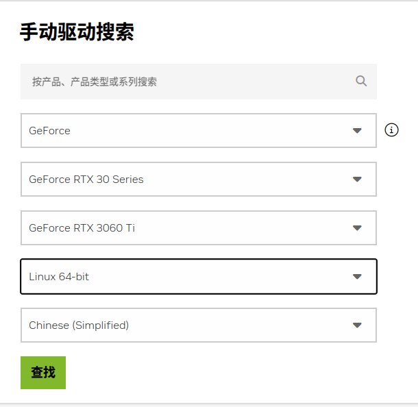

# ubuntu安装nvidia显卡驱动踩坑与拯救办法
最近又安装了一次显卡驱动，由于自己之前安装过很多次了，所以这次很自信的没有完全按照教程来，不出意料的踩坑了。黑屏、无法进入桌面等等问题，在以前可能直接就会选择重装系统，但是这次细细思考了一下，通过检索了一些资料最终完美救回了，这里备份记录相关的内容。
## 下载对应的显卡驱动
这里推荐使用.run文件来运行，使用这种方法是与cuda的兼容性最好，理论上也比较简单的。但是主要是安装run文件时候需要关闭所有的GUI界面，在这个界面下很多刚熟悉linux的人感到非常的陌生，容易造成很多的错误。
第一步还是下载显卡驱动，首先就是要知道自己的显卡型号，在linux下看到的不是非常直观，只能看到显卡的内核型号。还是建议在windows下看一下显卡的型号。
去英伟达官网下载对应的显卡版本，链接地址参见[英伟达驱动地址](https://www.nvidia.cn/drivers/lookup/)。
搜索参考下图，应该不用过多描述

建议将下载的显卡驱动放在根目录下，如果你的系统语言是英文就随意了。如果是中文在后面进入命令行模式下会乱码和无法输入，所以还是放在根目录下方便一点。
## 关闭开源GPU驱动
关闭开源驱动，没有其他意思，哈哈。
很多教程直接写的vim，这里换成你想用的任何编辑器gedit vim等等。
```shell
sudo gedit /etc/modprobe.d/blacklist-nouveau.conf
```
将开源驱动加入到黑名单中
```
blacklist nouveau
options nouveau modeset=0
```
更新一下系统，重启系统。
```shell
sudo update-initramfs -u
sudo reboot
```
查看开源驱动是否被屏蔽
```shell
lsmod | grep nouveau
```
如果没有输出，说明屏蔽成功。
## 安装驱动
到屏蔽开源驱动一般还没有问题，下一步安装驱动一般会有很多问题，我也在这里踩坑了。这里记录一下步骤和出问题之后的解决方法与思路。当前前提是第一次安装驱动的系统，对于卸载之前的驱动，重新安装的坑我还没踩过，这里声明一下，以免造成错误。
整体思路就是
- 进入命令行界面，以免GUI界面在安装显卡驱动时造成问题。
- 关闭显示服务
- 安装驱动
- 开启显示服务
- 退出命令行界面，重启，安装完成。
1. 进入命令行界面
   这里推荐使用下面的方法进入命令行，因为我在使用ctrl + alt + f2的时候进入时候，关闭GUI界面有时候会失败。
   ```shell
   sudo telinit 3
   ```
   退出命令行也很简单，将3换成5就行
   ```shell
   sudo telinit 5
   ```
2. 关闭显示服务
   ubuntu20.04默认使用gdm3，所以关闭显示服务就是关闭gdm3服务。其他系统类似lightdm的自己替换为自己的显示服务就可以。
   ```shell
    sudo service gdm3 stop
   ```
3. 安装驱动
   进入到自己存放驱动的目录下，执行命令
    ```shell
    sudo ./NVIDIA-Linux-x86_64-525.105.17.run -no-opengl-files -no-x-check -no-nouveau-check
    ```
    其中比较关键的是-no-opengl-files，这个参数是禁用opengl服务，不然会循环登录。剩下两个我实测不写也没有什么问题。
    安装过程中会有三次确认，分别是确认是否安装，确认是否要安装32位库以及是否要覆盖xorg配置文件。
    第一个选择continue，第二个选择no，第三个选择no。
    第三个一定要选择no，这个选项最关键，选择yes之后显卡会指定显示的桌面，选错了大概率黑屏。
4. 启动显示服务
      ```shell
    sudo service gdm3 start
   ```
5. 进入图形界面
      ```shell
    sudo telinit 5
   ```
   使用nvidia-smi命令查看显卡信息，如果出现当前显卡使用情况，说明安装成功。

## 解决黑屏问题思路
不幸的是，我在安装驱动中在是否要覆盖xorg配置文件选择了yes，导致我只能使用外接屏幕查看。后来分析了一下第三步是做了什么。
```
Would you like to run the nvidia-xconfigutility to automatically update your x configuration so that the NVIDIA x driver will be used when you restart x? Any pre-existing x confile will be backed up.
```
说人话就是要不要使用nvidia-xconfigutility来更新你的 xorg.conf，而xorg.conf就是配置你的多个显示设备输出搭配的。在插着外接屏幕时，nVidia的配置会选择外接屏幕，而且他的显示是写死的，即使拔了外接屏幕也不会在笔记本显示器上显示。
解决方法也很简单，直接修改xorg.conf文件就可以。
如果这时候没有病急乱投医选择重装驱动，直接去/etc/X11/下就能找到英伟达备份的文件。删掉之前，把英伟达的改下名字就行。
如果多次重装驱动，这时候备份的文件也被覆盖了，那直接编辑当前的xorg.conf文件，内容全部删了，原始的xorg.conf文件就是空文件。重启一下就解决了。
没有这个文件，自己新建一个也一样的，留个空文件就行。
## 有时候会掉驱动问题
安装完成之后有可能重启之后驱动掉了，这个时候不要慌，重启一下，在grub界面看下是不是有多个内核了，有多个内核，直接选旧的那个应该就行。可以选择自己固定一下内核，这就不在赘述了。
## 参考链接
感谢互联网的分享精神，下面是当时浏览器中还没关掉的链接，只是自己参考的一小部分，其他的在历史记录里太多了就不一一放上了。
[](https://blog.csdn.net/youduba7/article/details/128094633)
[](https://blog.csdn.net/seaship/article/details/86233325?fromshare=blogdetail&sharetype=blogdetail&sharerId=86233325&sharerefer=PC&sharesource=qq_43293480&sharefrom=from_link)
[](https://blog.csdn.net/ChaoFeiLi/article/details/110945692?fromshare=blogdetail&sharetype=blogdetail&sharerId=110945692&sharerefer=PC&sharesource=qq_43293480&sharefrom=from_link)
[](https://blog.csdn.net/ChaoFeiLi/article/details/110945692?fromshare=blogdetail&sharetype=blogdetail&sharerId=110945692&sharerefer=PC&sharesource=qq_43293480&sharefrom=from_link)

