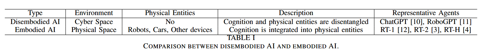
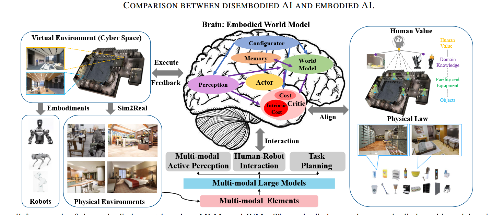
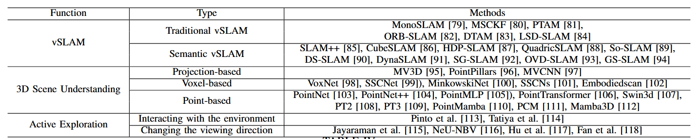
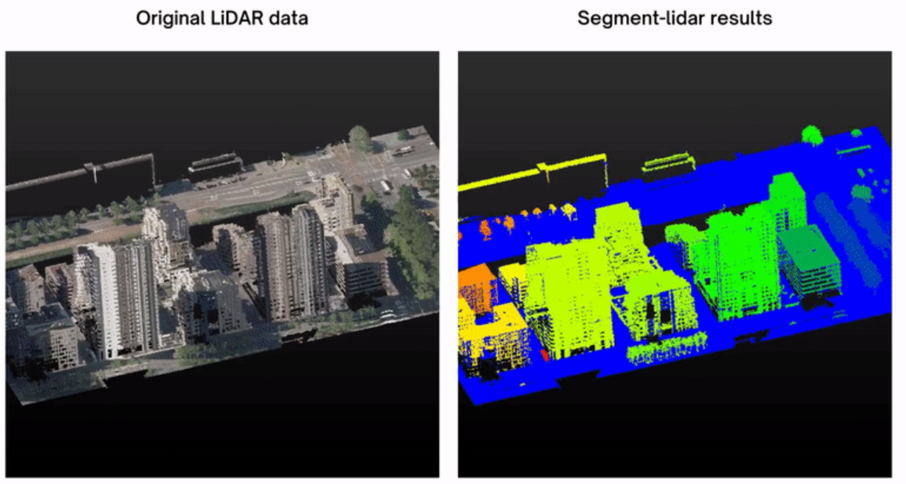
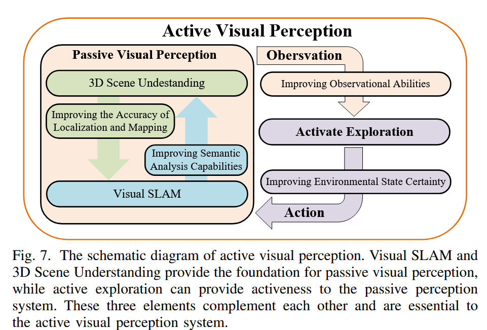
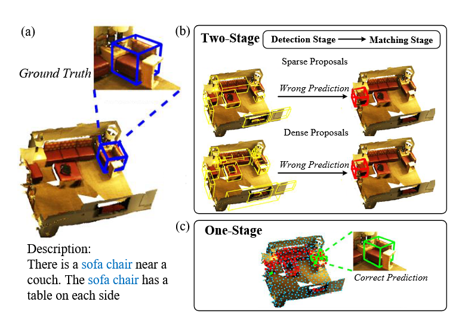
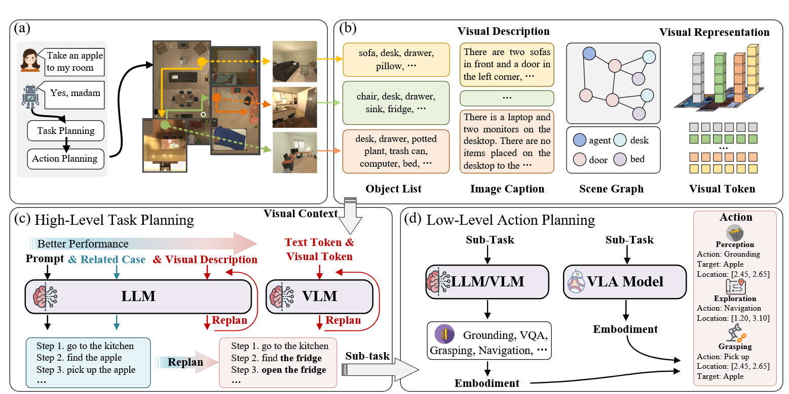

# introduce
什么是具身智能
**具身智能与离身智能**
- 具身（embeddedAI）
旨在确定代理是否可以显示不仅限于解决虚拟环境中的抽象问题的智能（网络空间1），但它也能够驾驭物理世界的复杂性和不可预测性。网络空间中的代理通常被称为无实体 AI，而物理空间中的代理则被称为具身 AI。

多模态大型模型 （MLM） 的最新进展为具身模型注入了强大的感知、交互和规划能力，以开发与虚拟和物理环境积极交互的通用实体和机器人[2].
基于多模态和世界模型，可以将具身智能划分为以下几个模块：

- 世界模型
- 记忆力机制
- 感知模块
- 使用记忆机制进行的强化学习的更新

# 机器人的几种形态

# 仿真环境

# 具身感知

## SLAM系统的几个阶段

## 视觉感知方案

## 3D感知

## 视觉导航

## 非视觉-触觉导航方案

## 
## vSLAM
传统的 vSLAM 系统利用图像信息和多视图几何原理，在未知环境中估计机器人的姿态，构建由点云组成的低级地图（如稀疏地图、半密集地图和密集地图），例如基于滤波器的方法（例如 MonoSLAM）[79]、MSCKF[80]）、基于关键帧的方法（例如 PTAM[81]、 ORB-SLAM[82]）和直接跟踪方法（例如 DTAM[83]、LSD-SLAM[84]).由于这些低级地图中的点云与环境中的物体不对应，因此具身机器人很难直接理解和使用。
## 语义SLAM
早期作品，如 SLAM++[85]，使用实时 3D 对象识别和跟踪来创建高效的对象图，从而在杂乱的环境中实现强大的闭环、重新定位和对象检测。立方体大板[86]和 HDP-SLAM[87]在 Map 中引入 3-D Rectangular 以构建轻量级语义图。QuadricSLAM （四重奏）[88]采用语义 3D 椭球体在复杂的几何环境中实现对象形状和姿势的精确建模。So-SLAM （索大满贯）[89]在室内环境中纳入完全耦合的空间结构约束（共面性、共线性和接近度）。为了应对动态环境的挑战，DS-SLAM[90]、DynaSLAM[91]和 SG-SLAM[92]采用语义分割进行运动一致性检查，采用多视图几何算法来识别和过滤动态对象，确保稳定的定位和映射。OVD-SLAM[93]利用语义、深度和光流信息来区分动态区域，而无需预定义标签，从而实现更准确和稳健的定位。GS-SLAM 系列[94]利用 3D 高斯表示，通过实时可微分的展开渲染管道和自适应扩展策略来平衡效率和准确性。
**早期的语义SLAM主要是对环境动态物体的剔除**，着重点在于使用语义信息来提升自身的定位精度，重定位精度等。

## 结合3D场景的语义SLAM
3D 场景理解旨在区分对象的语义，识别它们的位置，并从 3D 场景数据中推断几何属性，这是自动驾驶的基础[127]、机器人导航[128]和人机交互[129]等。
利用lidar、深度相机等获得环境的点云信息，构建环境的三维环境，但是由于**点云是稀疏、无序和不规则的**，和图像不同，对于机器人的三维空间理解造成了困难。
## 对环境的主动交互-2DVG
这部分更多的集中在利用视觉等信息知道机械臂(类似)对环境进行主动交互。
或者通过改变视角等获得更多的感知信息。
Given that robots are capable of movement and frequent interaction with their surroundings, they should also be able to explore and perceive their environment actively.
通过改变视角对环境进行自行探索，获得对于环境的感知。这种自行感知探索世界的框架如下图所示：

## 3D Visual Grounding
使用3D信息获得环境的语义信息，3D信息可以获得环境中的深度等信息，直接建立环境的语义地图。

# 具身智能框架

