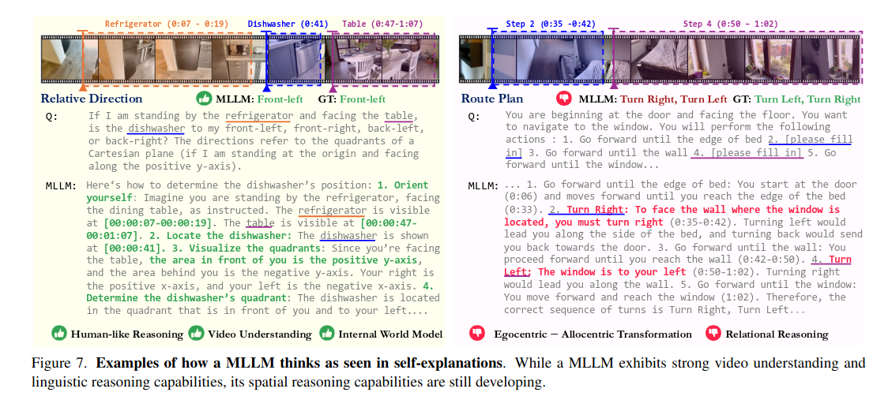

# Thinking in Space: How Multimodal Large Language Models  See, Remember, and Recall Spaces
大语言模型能够对环境中的物体进行识别，但是大语言模型不能构建起空间的认知，形成空间的认知地图。
值得注意的是，目前流行的语言推理技术(例如,思维链,自洽,思维树)并没有提高性能，而在问答过程中显式生成认知地图增强了多层线性语言模型的空间距离能力。

**空间智能的几个重要的点**
- 关系推理
- 不同关系的之间的转变

**为了测试多模态大模型在思维和理性能力，本文提出了一种基于视频的测试基准VSI-branch**

MLLMs exhibit emerging visual-spatial intelligence despite the challenges of video understanding, textual understanding, and spatial reasoning (Sec. 4).
MLLM表现出了一定的空间智能

**dual-coding theory**，双重编码理论的启发，视觉信息和语言信息是不同并且互补的，空间智能模型趋向于语言模型和视觉模型，也就是self-explanations(lingustic)和cognitive(visual)两种模型。

## 空间智能的几个薄弱的点
- 在self-explanations方面，也就是Llingustic，语言方面，空间的推理是一个薄弱项。
- **认知地图**，代表了对环境的内在表述的测试，表现出了MLLMs对于局部地图的构建能力比较出色，对于全局地图的构建能力比较差。
- 使用语言的推理技术无法提高性能，只有采用显式生成认知地图的方式才能够提高认知性能。

## 视觉空间智能
本文中使用intelligence来更宽泛的表示，而不是心理学上的cognition.本文的侧重点还是视觉上的智能，主要侧重点是实际的场景，办公室，工厂等。
对空间智能作出了几个划分：
- 视觉智能
- 语言智能
- 时间处理
- 空间推理

## VSI-branch
VSI-branch是一个基于视频的测试基准，VSI-branch是一个视觉的测试数据集合。
VSI-branch包含三种类型的八个任务，object count, relative distance, route plan。对象计数，相对距离和路径规划。

## benchmark models
**基准模型**：For proprietary models, we consider Gemini1.5 [76] and GPT-4o [33]. For open-source models, we evaluate models from InternVL2 [14], ViLA [44], LongViLA [88], LongVA [98], LLaVA-OneVision [39], and LLaVA-NeXT-Video [99]. All evaluations are conducted under zero-shot settings and using each model’s default prompts. To ensure reproducibility, we use greedy decoding for all models.
**测试标准设计 Metric Design**

**人类评估设计**Human Level Performance. We randomly sample a subset of 400 questions (50 per task), which we will refer to as VSI-Bench (tiny). Human evaluators independently answer each question, and their performance is evaluated using the above-mentioned metrics. For comparison, we also report Gemini-1.5 Pro’s performance on VSI-Bench (tiny). See Appendix C for details on evaluation setups.

## 实验结论
### Human Level Performance 人类等级测试
毫不奇怪，人类评估者在我们的基准测试中达到79％的平均准确性，表现优于最佳模型33％。值得注意的是，**人类在配置和时空任务上的表现非常高，范围从94％到100％，表明人类的直觉。相比之下，在需要精确估算绝对距离或大小的三个测量任务上，人类与最佳MLLM之间的性能差距要窄得多，这表明MLLM在需要定量估计的任务中可能具有相对强度。**
### 未开源模型水平
尽管人类的性能差距很大，这是领先的专有模型Gemini1.5 Pro，但仍带来了竞争成果。它超过了机会水平的基线，并设法在诸如绝对距离和房间大小估计等任务中达到人类水平的绩效。值得注意的是，尽管人类评估者在空间上有多年的理解经验，但MLLM仅在诸如互联网视频之类的2D数字数据上接受培训。
### Open-source MLLMs.
诸如LLAVA-NEXT-VIDEO-72B和LLAVA-ONEVISION-72B之类的顶级开源车型表现出对CloseSource型号的高度竞争性能，使领先的Gemini-1.5 Pro仅下降了4％至5％。但是，大多数开源模型（7/12）在机会级别的基线以下执行，表明其视觉空间智能的限制很大。
### Blind Evaluation.
我们使用六个最强型号（3个开源和3个封闭源）中的平均值将MLLMS的性能与“机会级别（频率）”和“视觉禁用”（盲）结果进行比较。如图6所示，“启用 - 脱节”和“残疾人机会”中的一般退化的一致改进表明，视频对我们的VSI基础是必不可少的，并且盲人模型在机会水平以下的表现。同时，MLLM努力在绝对距离估计，路线计划和相对方向任务（无论是否启用视觉）中提高机会水平，这强调了这些任务的困难。请注意，在对象大小上，“视觉禁用”模型已经明显超过了机会级别，这可能是由于在语言模型培训中学习的常识性知识所致。

## MLLMs在语言层面如何思考
### probing via self-explanations

在上图中，MLLMs展现除了对于视频流的一部分理解能力，并且MLLMs能够构建起全局的坐标链。在一些错误实现中，MLLMs没有能够实现从全局坐标到自身坐标的转换。
目前MLLMs在视觉信息上的错误可以分为以下四类：
- 视觉感知误差，未识别到对象或者错误识别对象
- 逻辑错误，由于推理错误导致的语言智能错误
- 对距离，方向和大小的空间推理错误 **这部分错误是语言模型的产生的主要错误**
- 不正确的坐标转换关系造成的错误

### 空间视觉技术的对CoT方法的限制
CoT方法，也就是思考链。这表明鼓励模型思考更多不仅是不可靠的，而且有害。

## How MLLMs Think in Space Visually
### probing via cognitive maps
使用显式的认知图来表达空间，对于显式的认知图，使用欧式距离来评价模型的空间关系。
对于较小的空间，MLLMs能够较好是形成认知地图，但是随着物体之间的关系逐渐变大，这个精度逐渐的下降。

### Better distance reasoning via cognitive maps
通过认知地图能够更好的实现空间的推理。
通过视频识别形成的相对空间距离来形成认知地图，测试通过认知地图产生的局部距离意识是否转移到改进的距离回忆和推理。
我们建议Gemini - 1.5 Pro首先根据给定的视频和问题生成认知地图，然后使用预测的地图来回答问题。如表所示。3a中，我们发现使用心理表象可以使MLLM的相对距离精度提高10 %。与真值认知地图相比，20 %到32 %的增益强调了建立准确的场景心理地图的重要性，它可以实现全局一致的拓扑结构，但这表明这种心理意象只是谜题的一部分，尽管它是一个关键的部分。这些结果都指向作为构建心理空间世界模型或认知地图

讨论和未来工作我们通过建立VSI - Bench并研究MLLMs在其上的性能和行为来研究模型如何看到、记忆和回忆空间。我们对MLLMs如何在空间中进行语言和视觉思维的分析，确定了现有的优势(例如,突出的感知能力、时间能力和语言能力)和视觉-空间智能(例如,自我中心-自我中心转换和关系推理)的瓶颈。虽然现有的语言提示方法并不能提高空间推理能力，但构建显性认知地图确实能提高多层线性模型的空间距离推理能力。未来的改进途径包括针对特定任务的微调、开发用于空间推理的自监督学习目标或视觉空间定制的提示技术

## 总结与点评
这篇文章主要是通过双重的语言和视觉两个方面来对空间智能进行评价，整体值得主义的结论是**人类在配置和时空任务上的表现非常高，范围从94％到100％，表明人类的直觉。相比之下，在需要精确估算绝对距离或大小的三个测量任务上，人类与最佳MLLM之间的性能差距要窄得多，这表明MLLM在需要定量估计的任务中可能具有相对强度。**同时认知地图等也对空间推理有一定的能力。
