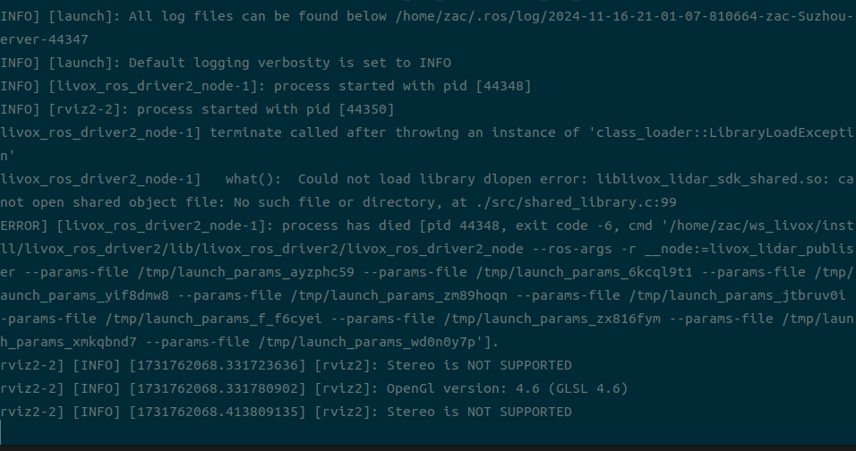
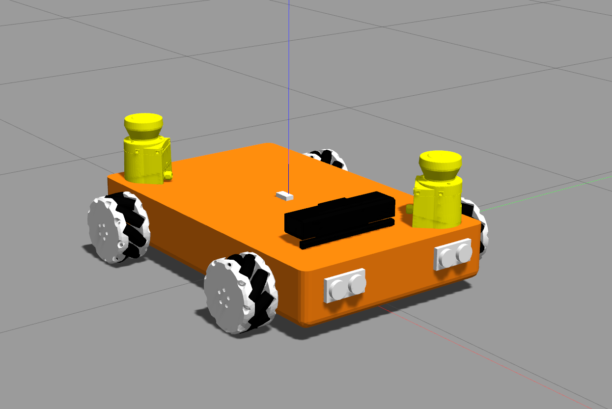
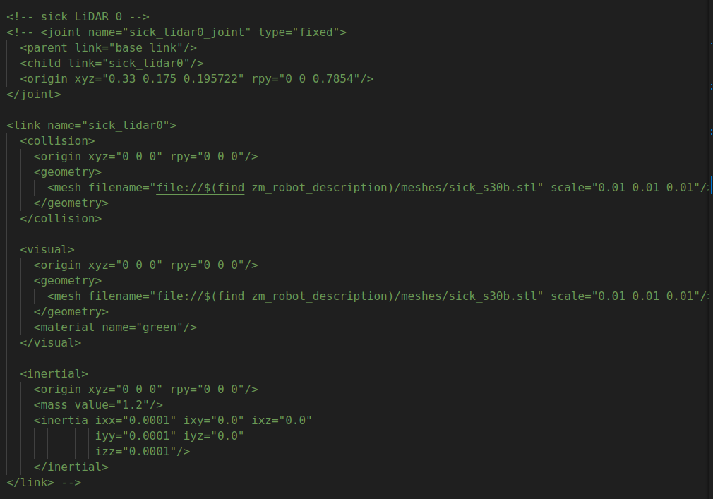
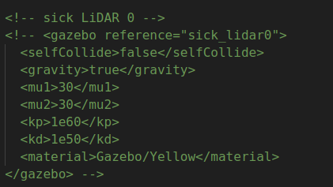
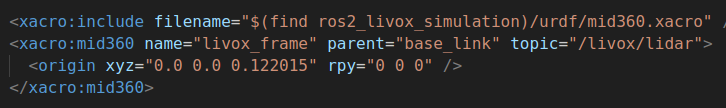
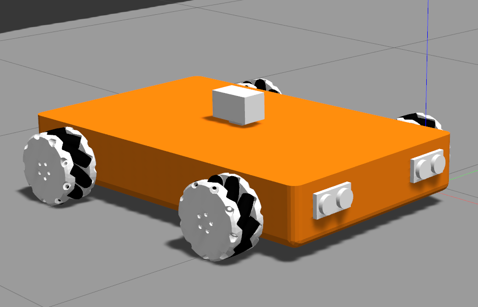
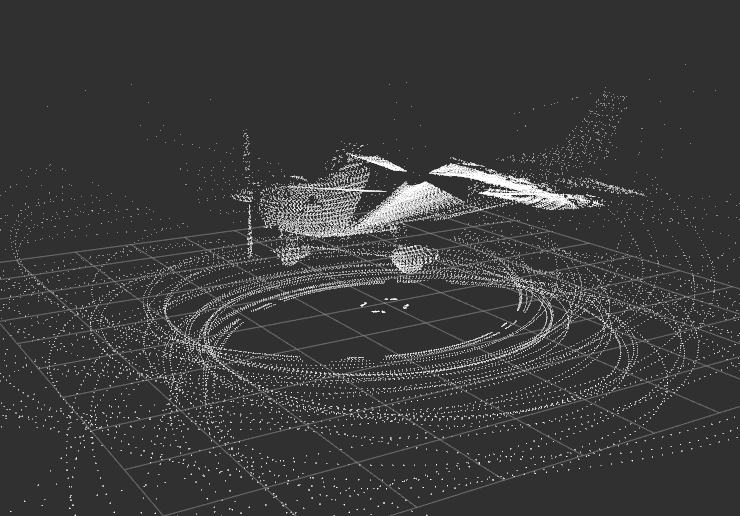

# 安装mid360在ros2中的驱动
## 安装livox-SDK2
```bash
git clone https://github.com/Livox-SDK/Livox-SDK2.git
cd Livox-SDK2/
mkdir build
cmake .. && make
sudo make install
```
下载完成后在编译之前需要将livox-SDK的库文件的路径声明下，直接写到bashrc里面比较方便一点，不然每次都要声明。将这句话加入到bashrc里面。
```bash
export LD_LIBRARY_PATH=${LD_LIBRARY_PATH}:/usr/local/lib
```
[livox-SDK2 github链接](https://github.com/Livox-SDK/Livox-SDK2)
## 安装livox_ros_driver2
- 下载源代码到本地
```shell
git clone https://github.com/Livox-SDK/livox_ros_driver2.git ws_livox/src/livox_ros_driver2
```
- 进入到下载的路径中
```bash
cd ws_livox/src/livox_ros_driver2
./build.sh humble
```
编译完成后测试一下
```bash
ros2 launch livox_ros_driver2 rviz_HAP_launch.py
```
启动成功，这里我没有连接雷达，所以是空白的，需要连接物理雷达参考readme中的步骤。

[mid360驱动github链接](https://github.com/Livox-SDK/livox_ros_driver2?tab=readme-ov-file)
## 安装livox_laser_simulation_RO2
由于livox官方没有提供雷达仿真在ros2中实现，所幸的是，有大神已经作了相关的移植工作。相关的连接见[livox_laser_simulation_RO2](https://github.com/stm32f303ret6/livox_laser_simulation_RO2)。
- 安装
在完成前面两步livox的驱动文件之后，进入自己的ros2工作空间，下载代码。
```bash
git clone https://github.com/LihanChen2004/livox_laser_simulation_ros2.git
colcon build && source install/setup.bash
```
这步完成之后就可以在自己仿真车中使用mid360了。
# 在gazebo仿真中安装mid360雷达
我使用的仿真小车是一个麦轮小车，其github仓库为[zm_robot](https://github.com/qaz9517532846/zm_robot/tree/ros2)。
启动起来是这个样子的。

下面就用这个小车的urdf文件来说明下怎么编辑这些传感器。
## 如何编辑仿真中的小车
gazebo仿真小车分为两个部分，一部分是结构信息与物理信息(惯性等)描述，另一部分是类似传感器这类插件的实现。我们打开刚才的mid360的仿真文件，这里面大致内容是这样的(为了节省空间只列出每个属性的简化版本)：
```xml
<?xml version="1.0" encoding="UTF-8"?>
<robot xmlns:xacro="http://ros.org/wiki/xacro">
  <!-- 属性设置 -->
  <xacro:property name="M_PI" value="3.1415926"/>
  <!-- 物理信息与结构信息等设置 -->
  <xacro:macro name="box_inertia" params="m w h d">
  </xacro:macro>

  <xacro:macro name="mid360" params="name:='' parent:= 'base_link' topic:='mid360' *origin ">

  <link name="${name}">
  </link>

  <joint name="${name}_joint" type="fixed">
  </joint>

  <!-- gazebo中传感器等插件设置 -->
    <gazebo reference="${name}">
      <sensor type="ray" name="${name}">
      </sensor>
    </gazebo>
  </xacro:macro>

</robot>
```
在目前大多数较的小车的仿真文件中，一般将这些内容分为两部分，一部分是.urdf.xacro文件,另一个是.gazebo文件。所以我们在这种小车的修改时，第一个是要修改.urdf.xacro文件，删除其中的link等信息，避免多余的link等，第二个是修改.gazebo文件，修改我们想修改的传感器信息。
如果你下载了zm_robot的代码，那么在zm_robot/zm_robot_description/urdf/文件中，可以找到相关代码，zm_robot这个机器人的仿真文件写的非常的清晰，个人感觉比turtlebot要更加清晰。
## zm_robot中传感器修改
由于我不需要原来仿真中的传感器，因此我直接将urdf文件和.gazebo文件中的传感器全部屏蔽。


然后在urdf中添加上livox的雷达，因为livox雷达两个描述部分都在一个文件中，所以我们只需要在urdf文件中添加下面的信息：

至此就更改完成了，重新编译，启动，即可看到livox雷达的仿真效果。


# 特别感谢
[zm_robot](https://github.com/qaz9517532846/zm_robot/tree/ros2)
[LIhanchen大佬移植的livox_ROS2仿真包](https://github.com/LihanChen2004/livox_laser_simulation_ros2?tab=readme-ov-file)
顺便推荐一下Lihanchen大佬的另一项工作[pb_rm_simulation](https://github.com/LihanChen2004/pb_rm_simulation/tree/main)