TODO
# 安装系统依赖
- ubuntu22.04
- Nvidia Isaac Sim 2023.1.1
- Nvidia orbit 0.3.0
- ROS2 Humble
- 安装anaconda
# 安装Nvidia Issac Sim 2023.1.1
## Issac下 载
项目指定了Issac Lab 版本，直接前往readme指向的链接下载就可以。
[](https://github.com/isaac-sim/IsaacLab/releases/tag/v0.3.1)
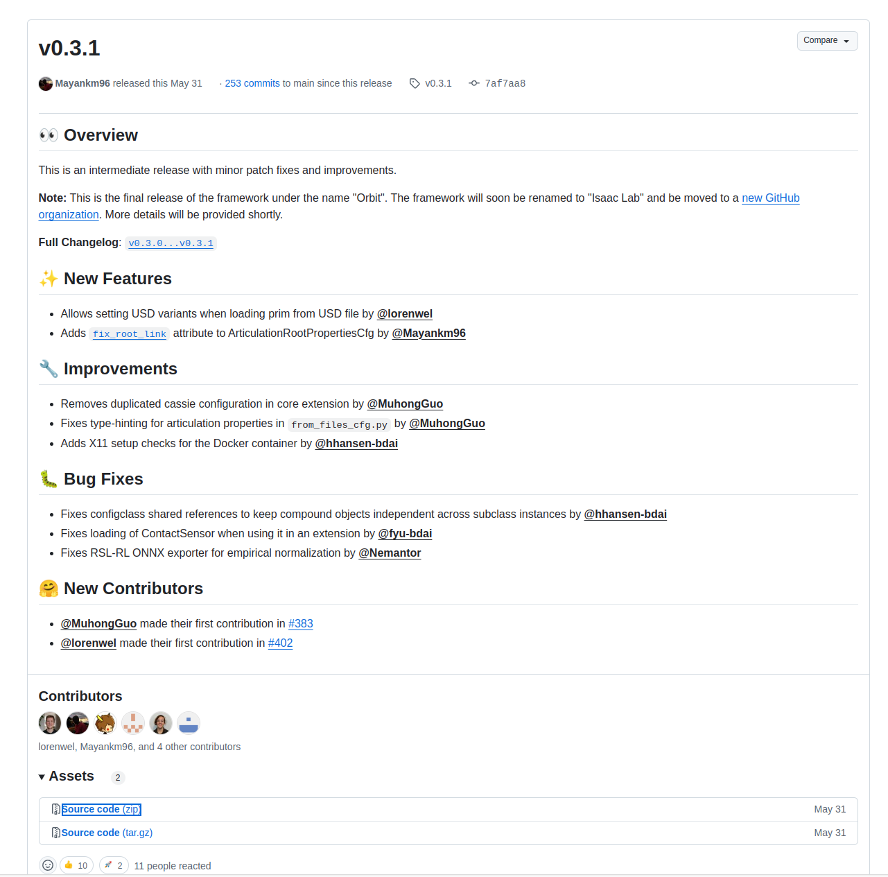
下载之后解压，等待后续使用。
## IssacSim 安装
安装仿真之前需要首先安装IssacSim2023.1.1
打开链接地址[NVIDIA Isaac Sim](https://developer.nvidia.com/isaac/sim)
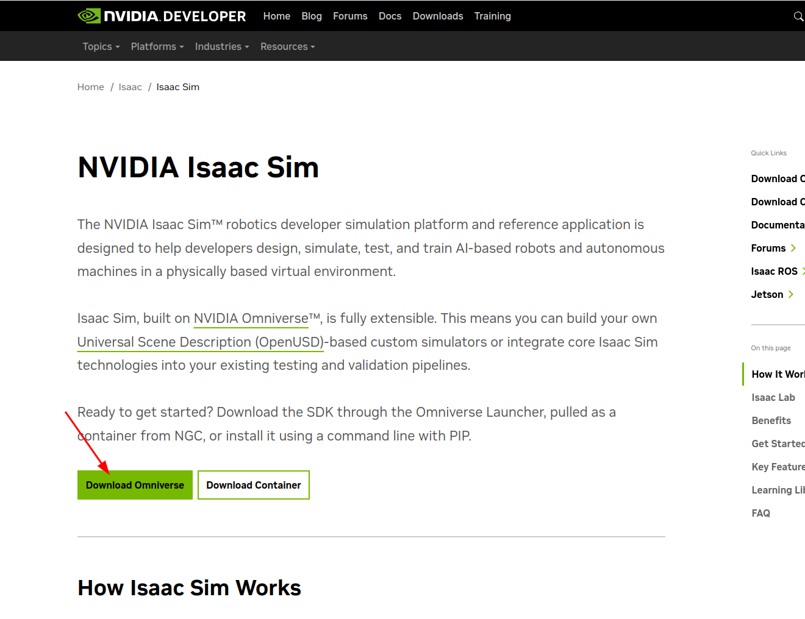
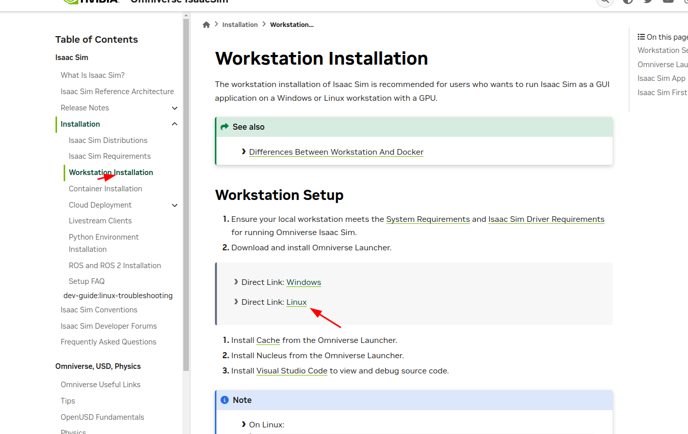
下载Omniverse完成之后给下载的appiimage文件添加权限，双击运行。这里我系统出现了BUG，双击无法运行，需要安装fuse依赖库。
```bash
sudo apt install libfuse2
```
成功启动

启动之后需要一个账号来登陆，我之前下载英伟达驱动时有注册，这里注册过程略过了。
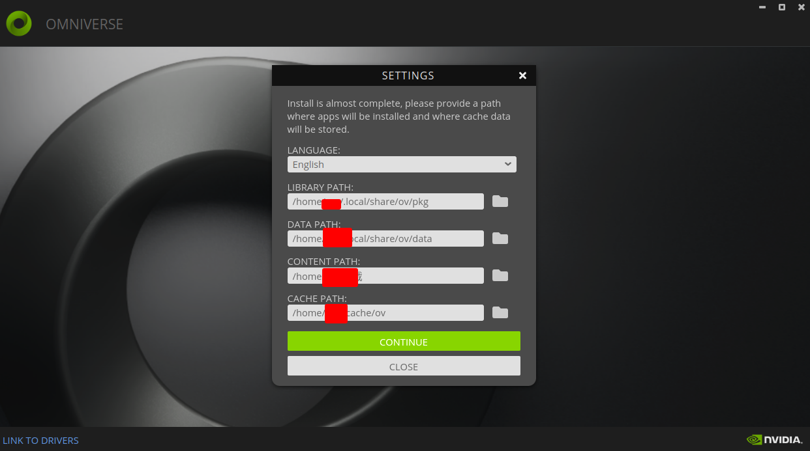
进入之后会有安装提示，这里尽量都不要更改路径，后续安装IssacLab时会指定路径，改动需要自己更改路径，比较麻烦。
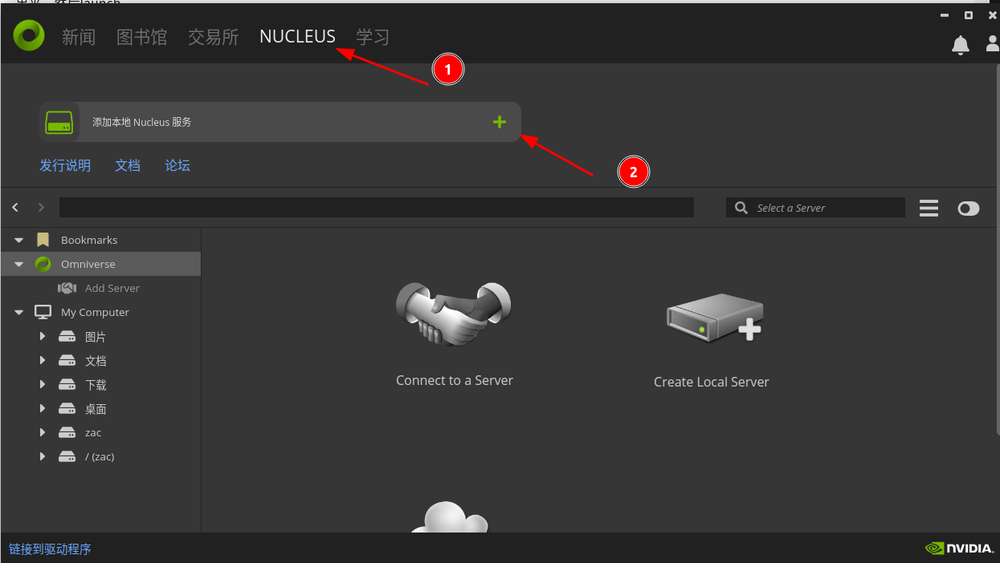
点击NUCLUES,新建一个本地的服务。中间按照提示新建就可以。点击确认。接下来会自动的进行一系列的下载和配置。
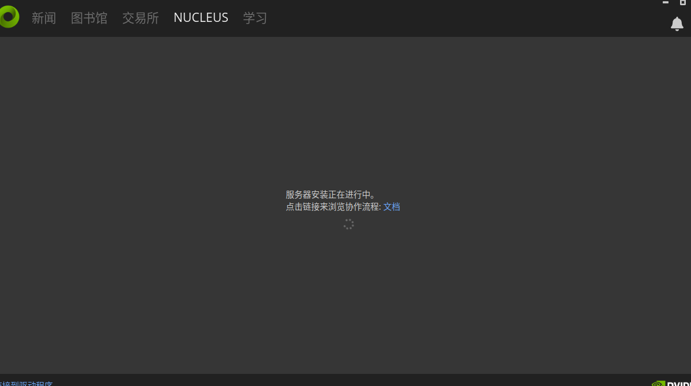
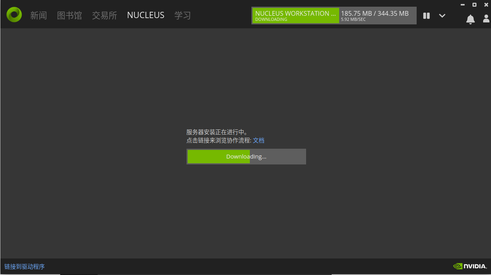

安装完成后如上图，接下来下载issacsim，交易所输入issac，就可以找到。点击安装。注意要选择版本，我这里选择4.0.0版本。
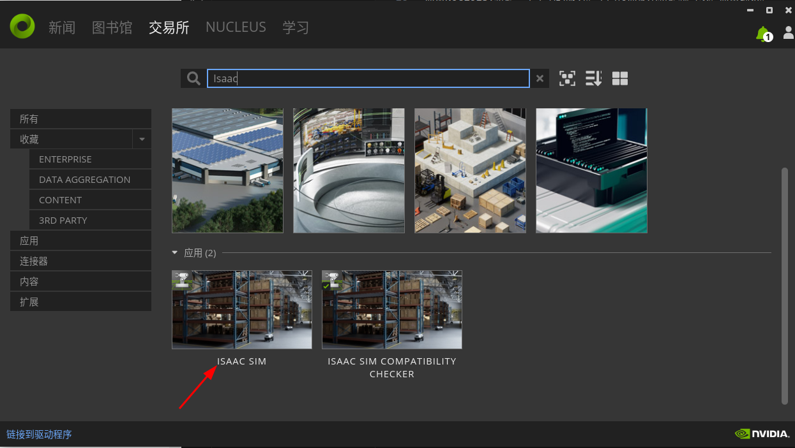
## Issac 安装指引
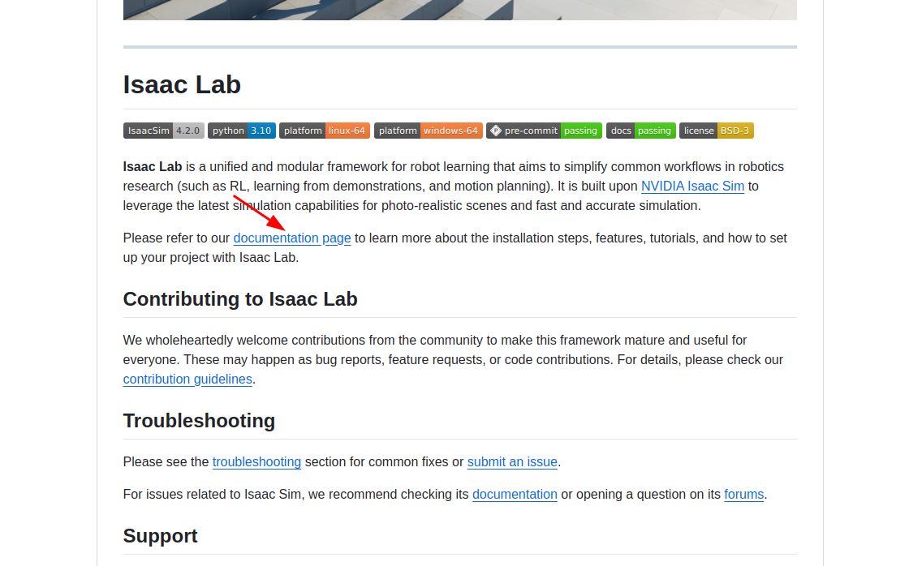
在Issac中的readme中可以找到Issac的安装指引页面。
声明Issac版本文件，声明完成之后进入到自己下载IssacLab的文件夹/
声明时要注意由于我上面使用了4.0.0版本，所以这里声明的版本号也得是4.0.0。
```bash
export ISAACSIM_PATH="${HOME}/.local/share/ov/pkg/isaac-sim-4.0.0"
export ISAACSIM_PYTHON_EXE="${ISAACSIM_PATH}/python.sh"
```
这里我还没有放进bashrc里面，后续需要还是建议放到bashrc里面。
下一步添加_issac_sim的软连接,注意这里需要之前声明的issac sim的位置正确，建议新建一个终端查看上一步声明的路径是否正确，否则只会新建一个空链接，
```bash
ln -s ${ISAACSIM_PATH} _isaac_sim
```
然后按照宇树教程运行一下：
```bash
./orbit.sh --conda
```
这个命令会自动创建一个conda环境，安装相关依赖，安装进程如下面图：
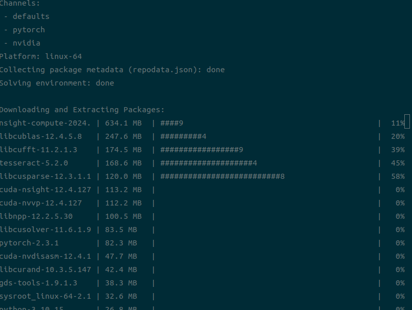
安装完成后有报错，检查之前连接的软链接是否是个空链接，我这里是更改版本之后忘记重新生成软链接了，导致出现这个错误，重新生成一个新的链接即可解决。
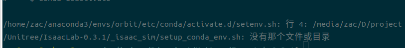
接下来安装一些依赖
```bash
sudo apt install cmake build-essential
./orbit.sh --install
```
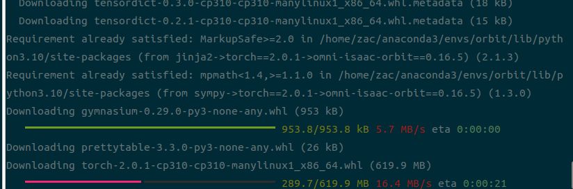
```bash
./orbit.sh --extra rsl_rl
```
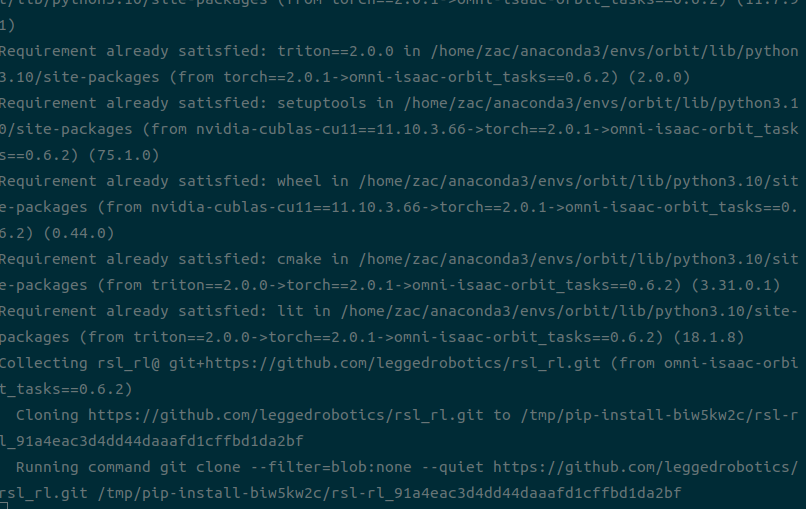
测试安装是否成功，需要在conda的orbit环境下运动
```bash
python source/standalone/tutorials/00_sim/create_empty.py
```