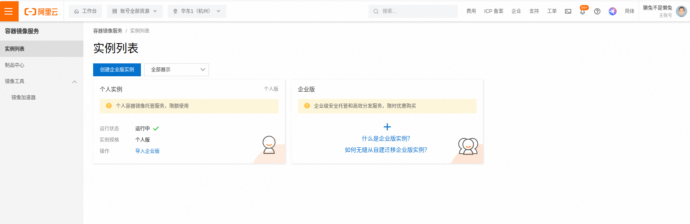

TODO
# 众擎安装过程
官方文档地址[engineai_humanoid](https://github.com/engineai-robotics/engineai_humanoid)
## 安装Docker
依赖系统Ubuntu 20.04，我的系统为U22,因此首先需要安装Docker。
### 更新源
```bash
sudo apt update
```
### 添加依赖库
1. 添加CE证书
```bash
sudo apt install apt-transport-https ca-certificates curl software-properties-common gnupg lsb-release
```
2. 添加Docker的CPG密钥
```bash
curl -fsSL https://download.docker.com/linux/ubuntu/gpg | sudo gpg --dearmor -o /usr/share/keyrings/docker-archive-keyring.gpg
```
3. 添加Docker仓库
```bash
sudo echo "deb [arch=$(dpkg --print-architecture) signed-by=/usr/share/keyrings/docker-archive-keyring.gpg] https://download.docker.com/linux/ubuntu $(lsb_release -cs) stable" | sudo tee /etc/apt/sources.list.d/docker.list > /dev/null
```
4. 更新apt包索引并安装Docker
```bash
sudo apt-get update
sudo apt install docker-ce docker-ce-cli containerd.io docker-compose-plugin
```
5. 查看docker运行状态并配置开机启动
```bash
systemctl status docker
```
显示下面的状态为配置成功

将docker设置为开机启动
```bash
sudo systemctl enable docker
```
6. 测试docker是否正常启动
```bash
sudo docker run hello-world
```
7. 将当前用户组添加到docker
```bash
sudo usermod -aG docker $USER
sudo reboot
```
添加完成之后就不需要sudo权限了，避免后续vscode中使用报错。

8. 添加国内镜像(失败方法)
这里我使用的是阿里云镜像源，由于提前注册好，因此只说怎么使用。
- 进入[阿里云镜像配置站](https://cr.console.aliyun.com/cn-hangzhou/instances)

- 点击左侧的镜像加速器，使用操作文档中的命令添加镜像加速器。

- 检查一下镜像加速是否添加成功。
```bash
docker info
```

但是这种方法设置失败了，后续使用docker使用代理设置成功！
9. 使用docker代理(成功方法)
[解密docker代理设置](https://blog.csdn.net/Dar_Alpha/article/details/134305538)
- 使用以下命令创建一个Docker代理配置文件（proxy.conf）。你可以使用任何文本编辑器来创建和编辑此文件
```bash 
sudo mkdir -p /etc/systemd/system/docker.service.d
sudo touch /etc/systemd/system/docker.service.d/proxy.conf
```
- 编辑代理配置文件
打开 proxy.conf 文件并使用文本编辑器（如nano或vim）编辑文件，添加以下内容：
```bash
[Service]
Environment="HTTP_PROXY=http://proxy.xxx.com:8888/"
Environment="HTTPS_PROXY=http://proxy.xxx.com:8888/"
```
请将 http://proxy.xxx.com:8888/ 替换为你实际的代理服务器地址和端口。这会告诉Docker使用代理服务器来进行HTTP和HTTPS请求。
- 更改文件权限
为了确保Docker可以读取这个配置文件，你需要更改文件的权限。使用以下命令：
```bash
sudo chmod 644 /etc/systemd/system/docker.service.d/proxy.conf
```
- 重新加载systemd配置：
```bash 
sudo systemctl daemon-reload
sudo systemctl restart docker
```
10. 拉取镜像
- 拉取portaniner镜像
```bash 
docker pull portainer/portainer
docker run -d --restart=always --name portainer -p 9000:9000 -v /var/run/docker.sock:/var/run/docker.sock --privileged=true portainer/portainer
```
安装完成之后进入127.0.0。1:9000访问管理界面.

## 安装engineai_humanoid依赖
### 安装CMAKE
为了使用onnx， cmake版本必须大于3.26
```bash
# 下载指定版本的cmake
wget https://cmake.org/files/v3.28/cmake-3.28.5.zip
# 解压并安装
unzip cmake-3.28.5.zip
cd cmake-3.28.5
chmod 777 ./configure
./configure
make
# 由于docker一直都是root目录，因此不需要sudo
make install
```
### 安装Eigen
官方首先使用的apt install, 避免eigen的版本不正确，使用make install的方法进行安装。
```bash
git clone https://gitlab.com/libeigen/eigen.git
cd eigen
git checkout 3.3.7
mkdir build && cd build
cmake ..
sudo make isntall
```
### 安装LCM
**安装依赖**
```bash
sudo apt install build-essential libglib2.0-dev
sudo apt install default-jdk python-all-dev liblua5.1-dev golang doxygen
sudo apt install openjdk-11-jdk
```
**安装LCM**
```bash
git clone https://github.com/lcm-proj/lcm.git
cd lcm
git checkeout v1.5.0
mkdir build
cd build
cmake -DLCM_ENABLE_JAVA=ON ..
make
sudo make install
```
### 安装ROS
使用fishros进行安装
### 安装onnx
**安装相关依赖**
```bash
sudo apt-get update
sudo apt-get install -y libprotobuf-dev protobuf-compiler
# 进入onnx根目录
git clone https://github.com/microsoft/onnxruntime
cd onnxruntime
# 这里docker中无法编译v1.19.0版本，切换到v1.18.0版本
git checkout v1.18.0

pip install -r requirements.txt.in
./build.sh --config Release --build_shared_lib --parallel --allow_running_as_root
cd onnxruntime/build/Linux/Release/
sudo make install
```
