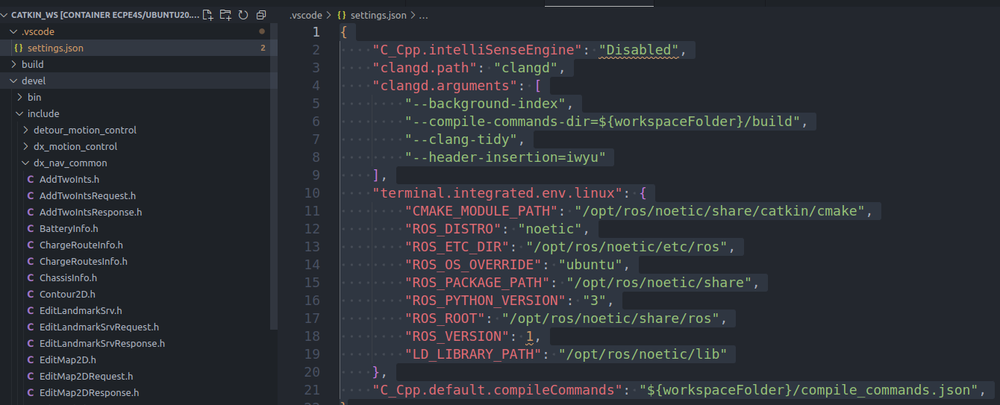

https://blog.csdn.net/qq_38738362/article/details/145184801?utm_source=miniapp_weixin

一个可用的vscode setting.json文件
'''json
{
    "C_Cpp.intelliSenseEngine": "Disabled",
    "clangd.path": "clangd",
    "clangd.arguments": [
        "--background-index",
        "--compile-commands-dir=${workspaceFolder}/build",
        "--clang-tidy",
        "--header-insertion=iwyu"
    ],
    "terminal.integrated.env.linux": {
        "CMAKE_MODULE_PATH": "/opt/ros/noetic/share/catkin/cmake",
        "ROS_DISTRO": "noetic",
        "ROS_ETC_DIR": "/opt/ros/noetic/etc/ros",
        "ROS_OS_OVERRIDE": "ubuntu",
        "ROS_PACKAGE_PATH": "/opt/ros/noetic/share",
        "ROS_PYTHON_VERSION": "3",
        "ROS_ROOT": "/opt/ros/noetic/share/ros",
        "ROS_VERSION": 1,
        "LD_LIBRARY_PATH": "/opt/ros/noetic/lib"
    },
    "C_Cpp.default.compileCommands": "${workspaceFolder}/compile_commands.json",
}
'''
用法

在工作目录的根目录创建.vscode文件夹，并将setting.json文件放入其中。
需要先编译工作空间，添加compile_commands.json文件
catkin_make -DCMAKE_EXPORT_COMPILE_COMMANDS=1

将生成json文件ln到根目录
ln -s build/compile_commands.json .