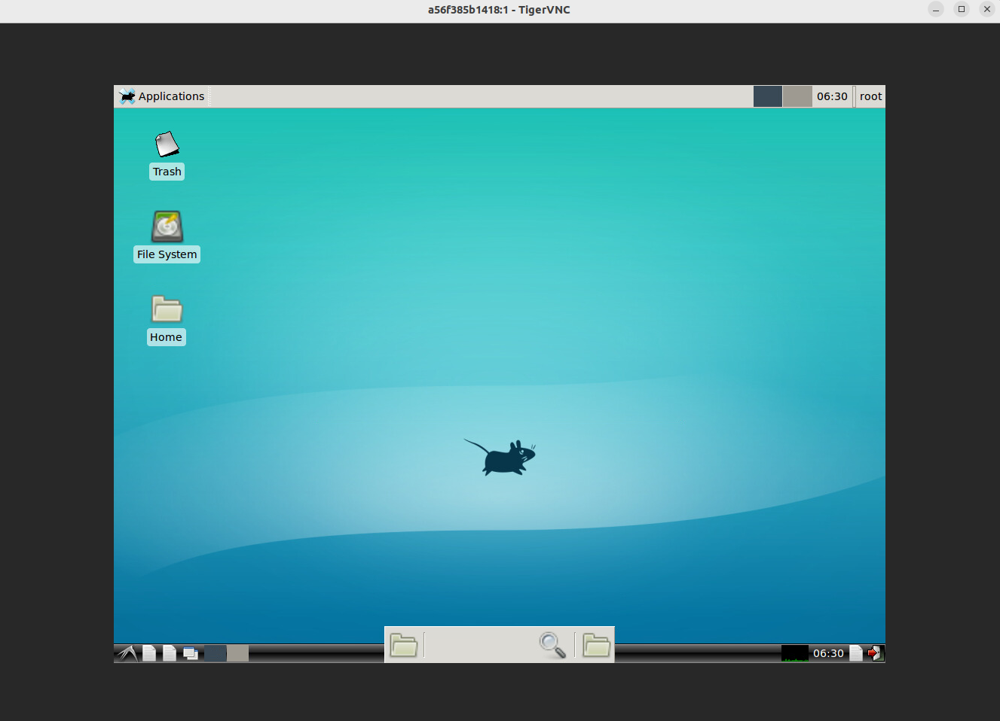

# 在DOCKER中安装可视化界面
在之前需要自行拉取docker镜像
## 使用固定IP和端口启动一个容器
```bash
docker run -it -p 5900:5900 -v /tmp/.x11-unix:/tmp/.x1 zkjoker/laserslam:v4 /bin/bash
```
启动了一个容器，端口为5900，映射到主机的5900端口，挂载了/tmp/.x11-unix目录。
## 启动一个虚拟的显示服务器-Xvfb
```bash
Xvfb :1 -screen 0 1600x900x24 &
```
启动了一个虚拟的显示服务器，端口为:1，分辨率位1024x768，颜色为24。
这时候查看是否报错，如果报错:Xvfb: command not found。需要安装xvfb
```bash
apt update
apt install -y xvfb
```
设置DISPALY环境变量
```bash
export DISPLAY=:1
```
安装VNC
```bash
apt-get install -y x11vnc xvfb lxde-core lxterminal
```
启动VNC
```bash
x11vnc -display :1 -forever -nopw &
```
就可以启动VNC界面了。
## 后续优化
安装xface桌面与相关的配置文件，保证docker的可视化界面的可用性。
**安装xface**
```bash
apt install -y xfce4 xfce4-goodies xorg dbus-x11 x11vnc xvfb
# 启动xface
startxfce4 &
```
**将参数添加到bashrc中**
```bash
echo "export DISPLAY=:1" >> ~/.bashrc
source ~/.bashrc
```
通过vnc连接docker的ip和端口，就可以访问docker内的可视化界面了。


