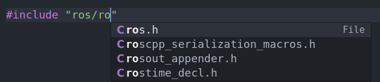
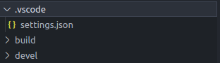

# 在vcode中使用复杂依赖ros工程
之前对vscode对于cpp的使用一直不是很理解，之前使用clion对本地上一些无交叉依赖的ros工程使用体验还可以，但是对于远程编辑和有较复杂交叉依赖的工程，clion的支持也不是很好。最近在使用ros2之后，由于编译方式的改变，clion也不能很好的实现代码的参数解析工作，网上检索一番，发现最后也是依赖compile_commands.json来实现代码解析，这和原来自己的半成品解析也没有什么差别，遂又切换会vscode，目前实现效果对于ros/ros2的头文件解析，本项目参数的解析都能基本实现，有一些小的不准确报错地方也无伤大雅，配合代码补全还是比较顺畅的。

vocode还有clion等基于cmake的ide/编辑器解析cpp的最基本原理就是通过解析cmake生成的compile_commands.json文件来实现本仓库的代码解析，对于其他头文件，特别是ros的头文件，在vscode的设置中添加ros库的路径，一般这些设置步骤都很多，很麻烦，所幸vscode可以有配置文件来配置。下面就分布说一下。
## 生成compile_commands.json文件
**对于ros1工程**
```bash
catkin_make -DCMAKE_EXPORT_COMPILE_COMMANDS=ON
将生成json文件ln到根目录，这一步我喜欢做，这样子简化setting文件的路径设置。
ln -s build/compile_commands.json .
```
**对于ros2工程**
```bash
colcon build --cmake-args -DCMAKE_EXPORT_COMPILE_COMMANDS=ON
```
但是ros2工程的解析文件在自己build目录下，可以使用compdb工具来将这些进行合并。
```
pip install compdb
工作空间根目录下执行
compdb -p build list > compile_commands.json
```
也可以使用其他方法，自己拼接啊，或者写一个工具自动拼接，最终得到一个包含所有包的compile_commands.json文件就行。
## vscode配置文件
vscode的配置文件主要就是配置两个东西，一个就是ros的头文件路径，其实就相当于source一下bash。第二个就是指向compile_commands.json。下面是一个我自己一直在使用的setting.json文件。由于我自己解析代码使用的是clangd，所以还有一部分clangd的参数，这部分不需要自行删除即可。
``` json
{   
    # clangd配置参数
    "C_Cpp.intelliSenseEngine": "Disabled",
    "clangd.path": "clangd",
    "clangd.arguments": [
        "--background-index",
        "--compile-commands-dir=${workspaceFolder}/build",
        "--clang-tidy",
        "--header-insertion=iwyu"
    ],
    # ros配置参数
    "terminal.integrated.env.linux": {
        "CMAKE_MODULE_PATH": "/opt/ros/noetic/share/catkin/cmake",
        "ROS_DISTRO": "noetic",
        "ROS_ETC_DIR": "/opt/ros/noetic/etc/ros",
        "ROS_OS_OVERRIDE": "ubuntu",
        "ROS_PACKAGE_PATH": "/opt/ros/noetic/share",
        "ROS_PYTHON_VERSION": "3",
        "ROS_ROOT": "/opt/ros/noetic/share/ros",
        "ROS_VERSION": 1,
        "LD_LIBRARY_PATH": "/opt/ros/noetic/lib"
    },
    # compile_commands路径参数
    "C_Cpp.default.compileCommands": "${workspaceFolder}/compile_commands.json",
}
```
用法就是在ros的工作空间根目录下创建.vscode文件夹，并将setting.json文件放入其中。然后使用vscode打开ros工作空间即可。


**其他的一些参考**
https://blog.csdn.net/qq_43293480/article/details/144817168?spm=1011.2124.3001.6209
https://blog.csdn.net/qq_38738362/article/details/145184801?utm_source=miniapp_weixin
