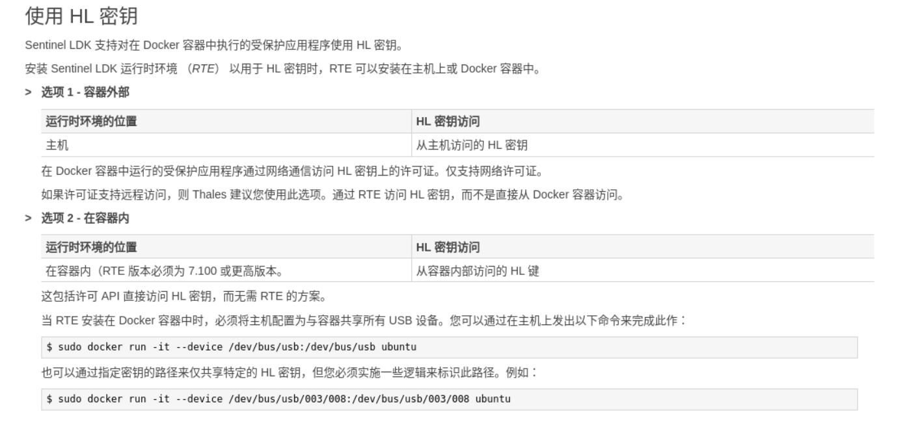

# 使用docker构建生产环境
## 加密狗的配置

1. 使用硬件狗作为加密狗
https://docs.sentinel.thalesgroup.com/softwareandservices/ldk/LDKdocs/SPNL/LDK_SLnP_Guide/Appendixes/Docker_containers.htm

```bash
sudo docker run -it --device /dev/bus/usb:/dev/bus/usb ubuntu
```
2. 使用软件狗作为加密狗
略

## 进行网络配置

在进行网络配置时选择 host模式


## 使用dockerfile从本地构建镜像

写一个dockerfile文件，使用本地的jharwell/ubuntu22.04:2024-08-21.0
镜像作为基础镜像，并且在构建镜像时使用sudo docker run -it --device /dev/bus/usb:/dev/bus/usb以共享所有的端口权限，并且将网络模式设置为host模式，并且新建一个用户robot，robot的路径要求为/home/robot/，并且默认这个用户为直接进入的工作用户。
```dockerfile
# 使用本地基础镜像
FROM jharwell/ubuntu22.04:2024-08-21.0

# 创建 robot 用户并加入 sudo 组
RUN useradd -m -d /home/robot -s /bin/bash robot && \
    usermod -aG sudo robot

# 配置免密 sudo（允许 robot 用户无需密码执行 sudo）
RUN echo "robot ALL=(ALL) NOPASSWD:ALL" >> /etc/sudoers.d/robot && \
    chmod 0440 /etc/sudoers.d/robot

# 设置工作目录
WORKDIR /home/robot

# 设置默认用户
USER robot

# 设置容器启动时的默认命令
CMD ["/bin/bash"]
```

启动镜像时运行：

```bash
# 构建镜像
sudo docker build -t navi_image .

# 运行容器
sudo docker run -it \
    --device /dev/bus/usb:/dev/bus/usb \
    --network host \
    navi_image
```

## 安装并且测试激光雷达驱动
1. 安装livox_sdk与livox_ros_driver


## 在宿主机安装加密狗驱动
要在宿主机中安装加密狗驱动程序，并且在docker中也安装加密狗的驱动程序，给docker镜像设置privalige权限。
在docker中使用lsusb进行检查，如果出现了加密狗的信息就说明可以使用。重启镜像和主机就可以启动加密狗。