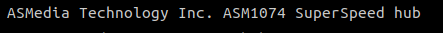

# 星动纪元-docker-导航配置与安装说明
说明文档版本：Dev-0.9.3 2023-03-29

## 启动docker镜像
1. 启动镜像
将导航docker镜像复制到宿主机本地上，需要以特权方式(`--privileged `)和host网络模式启动导航镜像(`--network host`)，启动命令如下:
```bash
docker run --privileged -it --network host "导航镜像名" bash
```
2. 检查镜像权限
- 启动镜像后使用`ifconfig`检查当前容器网络，显示结果应该与宿主机`ifconfig`结果一致。
- 使用`lsusb`检查端口情况，显示情况应该与宿主机一致。

## 加密狗配置
加密狗目前采用硬件加密狗，在配置加密狗时需要将加密狗从宿主机上取下。
1. 宿主机安装加密狗驱动
```bash
sudo dpkg -i aksusbd_10.11-1_amd64.deb 
```
安装完成后在宿主机插入加密狗，使用`lsusb`查看当前连接的usb设备，出现`Aladdin Knowledge Systems Sentinel HL`说明安装成功，如果安装后没有显示，重启宿主机重新插拔加密狗。


2. 在容器中检查加密狗链接
在导航的容器中使用`lsusb`检查当前usb链接，出现`Aladdin Knowledge Systems Sentinel HL`说明安装成功，如果安装后没有显示，重启容器进行测试。

## 配置激光雷达
激光雷达需要指定ip为`192.168.8.165`eloquent_colden
**雷达配置参考livox mid360 ip地址修改方法**

## 配置ros2 dds实现方式与通信域设置
需要在将底盘驱动镜像、测试笔记本等涉及ros2通讯的设备的ros2实现方式更改为cyclonedds，具体操作如下：
1. 检查系统安装的dds
```bash
ros2 pkg list | grep -i rmw
```
检查是否存在`rmw_cyclonedds_cpp`，若不存在，需要自行安装。
```bash
sudo apt install ros-humble-rmw-cyclonedds-cpp
```
2. 修改bashrc以使用cyclonedds
```bash
echo 'export RMW_IMPLEMENTATION=rmw_cyclonedds_cpp' >> ~/.bashrc
```

3. 应用更改：

```bash
source ~/.bashrc
```

4. 验证配置

验证DDS中间件设置是否生效：

```bash
echo $RMW_IMPLEMENTATION
```
应该显示：`rmw_cyclonedds_cpp`

5. 在两台主机上设置相同的`ROS_DOMAIN_ID`：

```bash
echo 'export ROS_DOMAIN_ID=<一个0-232之间的数字>' >> ~/.bashrc
source ~/.bashrc
```

