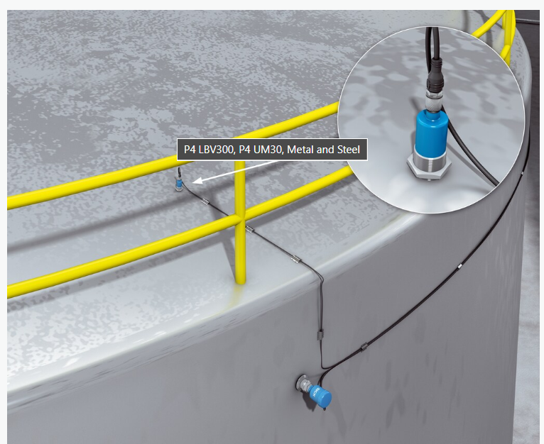

# 电解铝槽水平测量相关产品与方案

## 国外
**Sick电解槽收集容器中的液位监测**
电解槽将与冰晶石混合的富集氧化铝转化为熔融铝。在此应用中，电解槽进料罐中的材料需要定期加满。这是通过安装在起重机上的储物箱来实现的。需要连续测量这些储罐的液位，并分别监测“满”和“空”极限液位。用于连续液位测量的超声波传感器 UM30 和采用音叉技术的 LBV300 液位传感器非常适合监测限位填充液位。由于其设计和测量技术，这两种传感器也可用于强磁场。

**AlumatIQ阳极更换**
https://alumatiq.com/solutions/
**铝液深度检测装置-美国专利**
https://patents.google.com/patent/US6065867A/en
关键词 Method and device for measuring the temperature and the level of the molten electrolysis bath in cells for aluminum production
level of the molten electrolysis bath in cells for aluminum production
测量电解槽中用于电解氧化铝生产铝的电解槽中的熔融电解槽的温度和电解液液位的方法包括以下步骤：（a） 用破壳机刺穿凝固浴的外壳，并浸入电解液中，将温度探头的末端浸入足够的深度，直到测量到至少 850°C 的初始温度读数， 然后保持探针在所述电解液中的浸入时间，该时间长度小于在电解液中建立探针的热平衡所花费的时间，（b） 撤回探针并通过外推探针测量的温度来确定电解液的温度，（c） 通过将探针的下端移动来测量电池中电解液的液位电解质，同时记录阴极衬底和探针之间的电位信号，并记录与探针位置相对应的位置信号，以及 （d） 通过比较记录的电位和位置信号来确定电解液的液位。
Pechiney法国铝液公司，一种能够破开表面的探针与检测针头
**波士顿动力 spot机器狗**
https://www.osedea.com/insight/driving-innovation-in-aluminum-smelting-with-spots-advanced-tech
波士顿动力计划将spot机器人应用到铝液生产中
**龙门架式检测装置 美国专利**
https://patents.google.com/patent/US8647481B2/en
**澳洲铝液检测专利**
https://patents.google.com/patent/AU2015203272B2/en?q=(probe)+(electrolyte)+(crust)+(temperature)+(level)+(robot)&scholar&oq=(probe)+(electrolyte)+(crust)+(temperature)+(level)+(robot)
**一种用于生产铝的装置，包括阴极容器、阳极装置、用于在阴极容器和阳极之间产生直流电的装置，用于从浴中提取熔融铝，以及与凿子组装**
https://patents.google.com/patent/DE102008025090A1/en
该装置包括一个阴极容器、一个阳极装置、一个用于在阴极容器和阳极之间产生直流电的电源，用于从浴中提取熔融铝，以及一个带有凿子 （1） 的组件，用于打破外壳，该外壳在生产过程中在阳极装置的区域形成。凿子包括一个测量杆 （6），该测量杆放置在凿子的内管内，带有一个用于检测浴槽温度的温度传感器。所述测量杆包括直径较大的非金属上部 （7）。该装置包括一个阴极容器、一个阳极装置、一个用于在阴极容器和阳极之间产生直流电的电源，用于从浴中提取熔融铝，以及一个带有凿子 （1） 的组件，用于打破外壳，该外壳在生产过程中在阳极装置的区域形成。凿子包括一个测量杆 （6），该测量杆放置在凿子的内管内，带有一个用于检测浴槽温度的温度传感器。所述测量杆包括一个直径较大的非金属上部（7）和一个用于将测量杆固定在凿子上的小轴向延伸部分，以及直径较小的其余部分。凿子由三个空心圆柱体（2、3、4）组成，其中第一空心圆柱体用作夹套和凿子的底部区域，在第二和第一圆柱体与第三空心圆柱体连接时与第三空心圆柱体连接，形成承载测量杆的内管。第一和第三气缸之间存在气隙 （5）。测量杆的剩余部分在凿子的底部区域上方用尖端突出，尖端突出 0-50 毫米。凿子的内管由钢制成。气隙尺寸为 1-50 毫米，凿子的外径为 50-150 毫米。温度传感器的实现方式是将热电偶放在测量杆的下端，同时连接热电偶的电缆穿过测量杆内部。
## 国内
**中煤科工**
https://www.chinamai.org.cn/jishuzhuangbei/593.html
**煜拓智能**
https://www.szyutoo.com/Product/info/id/18.html
**槽底巡检机器人**
https://user.guancha.cn/main/content?id=325240
http://www.citichickc.com/
**一种预焙铝电解槽工艺参数测量方法及其装置 专利**

**电解铝行业智能检测与控制专家系统**
http://www.hymcu.com/images/kehuanli/93.html
**中南大学电解槽巡检机器人**
D:\Zachary\Project\电解铝项目\参考资料-国内外相关项目
使用多传感器分布在测量扦插上，不支持机械臂开门的操作。
**贵州铝液巡检机器人**
file:///D:/Zachary/Project/%E7%94%B5%E8%A7%A3%E9%93%9D%E9%A1%B9%E7%9B%AE/%E5%8F%82%E8%80%83%E8%B5%84%E6%96%99-%E5%9B%BD%E5%86%85%E5%A4%96%E7%9B%B8%E5%85%B3%E9%A1%B9%E7%9B%AE/CN118600482A.pdf
不支持开门操作，并且没有相关的实物产品
**铝电解槽电解质温度、两水平和炉底压降在线测量系统**
file:///D:/Zachary/Project/%E7%94%B5%E8%A7%A3%E9%93%9D%E9%A1%B9%E7%9B%AE/%E5%8F%82%E8%80%83%E8%B5%84%E6%96%99-%E5%9B%BD%E5%86%85%E5%A4%96%E7%9B%B8%E5%85%B3%E9%A1%B9%E7%9B%AE/CN112665642A.pdf
本发明涉及一种铝电解槽电解质温度、两水平和炉底压降在线测量系统，第一气缸、第二气缸固定在电解槽大梁上，第一气缸中设有热电偶，热电偶外套有耐腐蚀较强的保护套管，两水平和炉底压降测量元件为与第二气缸连接的高强度测量探头，第二气缸内设有位移传感器，位移传感器和第二气缸配合使用完成测量
