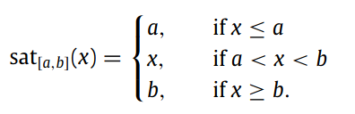
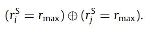
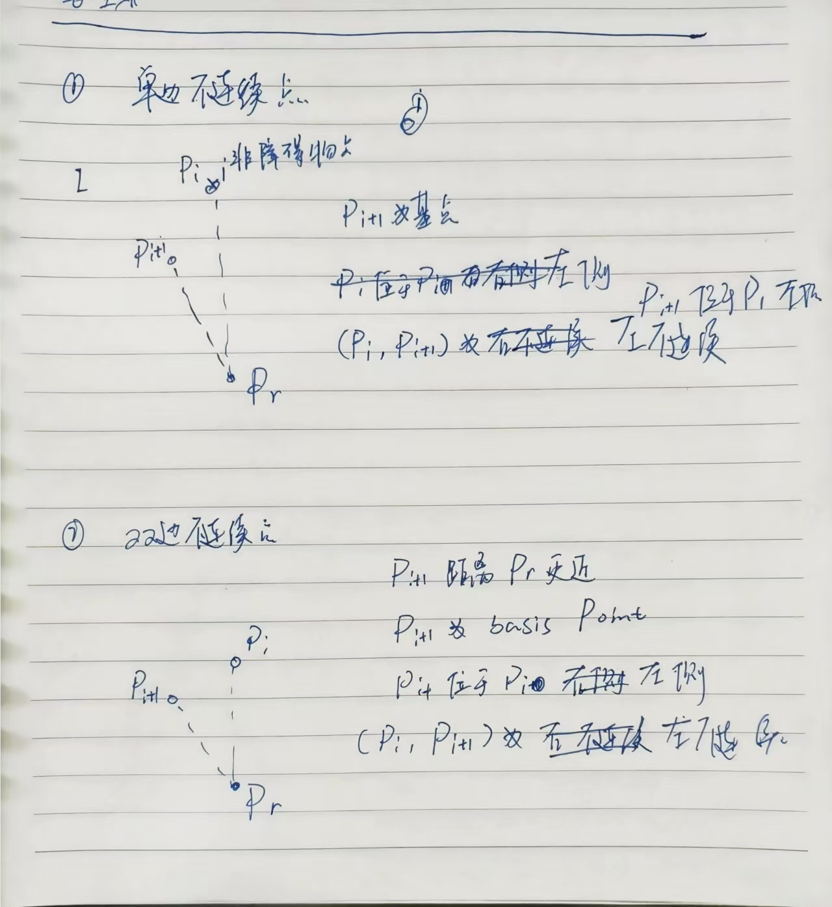
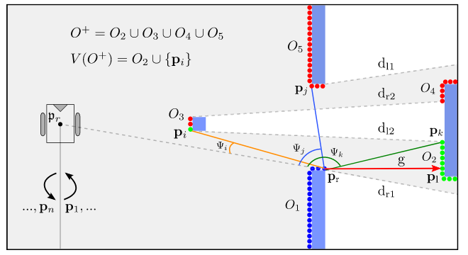
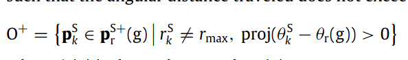
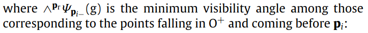
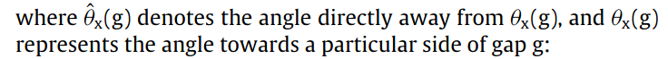
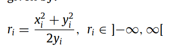

# Admissible gap navigation: A new collision avoidance approach (TODO)
相比于搜索式算法，基于gap的反应式算法能够在未知的稠密复杂环境中高效导航。可接受的gap是由两部分组成的：1. 机器人能够避免碰撞 2. 符合机器人的运动约束。
本文相对于传统的基于gap的导航方法不同，考虑精确的形状形状和运动学，而不是直接对方向进行规划。反应式的基本原则是，一旦穿越过gap，就直接向目标移动。
## Introduction
基于规划的避障方法在狭窄或者复杂的环境中，会出现局部最小值、转向失败、原地振荡（打转）等问题。针对这种问题，提出了一种gap-based methods。但是目前的gap-based method只是将机器人考虑位一个圆形的外形，并且没有考虑机器人的运动学约束，可能会导致某些不符合机器人运动约束的运动规划。针对上述问题：
1. Local incremental planning for a carlike robot navigating among obstacles, 使用最小二乘法将gap的方向解与机器人航向角进行对齐。
2. Robot navigation in very complex, dense, and cluttered indoor/outdoor evironments, 将问题分解为运动学、动力学等子问题进行分析。
本文提出了一个admissible gap（AG）可接受的gap方法。这个方法直接考虑形状和动力学的约束。
基本的思想是搜索车辆周围的一组gap，使用迭代的方法构建虚拟的允许gap，并在这个gap中进行路径规划。
## Related Work
pass
## Preliminary definitions
- 机器人采用差速驱动，在平坦地面上进行导航，并且假定轮子纯滚动
- $p_g$ 机器人目标位置
- $p_r$ 机器人当前位置
- R 机器人的虚拟圆半径
- $P_e, e = 1,..., m, m = 机器人拟合的多边形边数$ 使用m条边拟合机器人
- 传感器使用激光雷达scan
- $S = {p^S_1,...,p^S_n}$ 激光雷达点的集合
- $(r^S_i, \theta^S_i)$ 雷达点$P^S_i$的极坐标形式
- $(x^S_i, y^S_i)$ 雷达点$P^S_i$的直角坐标形式
- 点集的表示形式: $P_i^{S+}$ 表示 $ \{ P^S_{i+1}, ... ,P^S_n \} $，表示从i+1到n的点集(左侧的所有点集)。同理，$P_i^{S-}$ 表示 $ \{ P^S_1, ... ,P^S_{i-1} \} $，表示从i-1到1的点集(右侧的所有点集)。
- 如果是360度的FOV，那么$P_i^{S+}$和$P_i^{S-}$的边界点是相同的。
- **在算法中，点的顺序非常重要**
- 归一化函数 proj: 将角度映射到[-pi, pi]上：$proj(x) = ((\theta + pi)mod(2pi)) - pi$
- 饱和函数

## 提取gap
从当前的环境中提取gap list，核心思想是从连续深度中寻找不连续的深度点。
### 寻找深度不连续点
**根据机器人的形状定义机器人的最小通行宽度$\omega_{min}$**
对于两个不连续点$(P_i, P_j)$，满足下面两个判断条件的中的一个：
1. $P_i$和$P_j$之间的距离大于$\omega_{min}$ 。这种点之间有两个端点，可以称为**双边不连续gap**，对于双边不连续的点，**basis**是更接近机器人当前位置$p_r$的端点。
   
2. $P_i$或者$P_j$点大于传感器的最大感知范围，描述位非障碍物点(non-obstacle point)。，这种点成为**单边不连续gap**，单边不连续点的**basis**是它唯一的端点。

3. 如何将不连续点划分为左侧右侧：
   - 单边不连续点: 单边不连续点的基点位于非障碍物的右侧，就是右不连续点；反之亦然。
   - 双边不连续点：双边不连续点的基点位于另一个端点的右侧，就是右不连续点；反之亦然。
   - 不连续点的方向就是basis点在gap的左侧，就是左不连续点，basis在右侧，就是右不连续点。
    不连续点方向判断如下图所示：
    

**整体图解：**

图中存在四个障碍物，划分为5段连续深度，使用$O_1, O_2, O_3, O_4, O_5$表示。其中由$O_3, O_4$组成的不连续深度$d_{r2}$和由$O_3, O_2$组成的不连续深度$d_{l2}$是双边不连续深度.其他同理。

## 搜寻gap(gap search)
gap search的过程重复两次，顺时针进行一次，逆时针进行一次。
**逆时针搜索**
逆时针搜索时使用深度判断的方法计算右不连续点，下面是搜索左不连续点的过程。
1. 检查每两个深度点之间是否存在**右不连续点**，寻找gap在basis点右侧的gap，表示为$P_r(g)$.
2. 计算每个gap的左边界，检查两个深度点之间是否存在**左不连续点**：
   - 将找到的$P_r(g)$作为分界点，左侧的所有的osbtacle points作为一个集合$O^+$, 并且左侧的点集距离$P_r(g)$的角度范围为$[0, pi]$. 
   - 遍历$O^+$中的所有障碍物点，取第i个点为$P_i$, 构建一个由$p_r(g)$和$p_i$组成的gap，判断当前的gap是否能够被当前机器人位置$P_r(g)$观测到，根据能否被观测到给一个label of valid or invalid。观测的判断方法是当前的 **右不连续点$P_r(g)$** 与 **当前的判断的点$P_i$** 的连线上没有任何的障碍物点或者封闭区域。对于符合这个条件的点 **$P_i$**,定义这个点与右不连续点$P_r(g)$的角度为$P_i$相对于右不连续点$P_r(g)$的可见角度。可见角度的计算公式为：
    
    可见角度的推导过程如图所示：
    
    **如果满足下面的条件，则当前点$P_i$为valid:**
    
    其中：
    
    
    也就是说，只要当前点的可视角度比之前的所有的可视角度小，那么这个点就是有效的。
3. 在所有有效的障碍物点中，选取距离**右不连续点$P_r(g)$**最近的点障碍物点，记作$V(O^+)$. 这个$V(O^+)$就是左不连续点。
4. 如果不存在左不连续点，就需要构造一个虚拟点来充当左不连续点。如果当前的不连续点不存在左不连续点，那么左不连续点被按照下面的方式设置：
   - 距离等于 $R+d_{safe}$, 机器人半径加上安全距离
   - 角度等于右不连续点$P_r(g)$的左侧邻居的方向
5. 从左不连续点$P_l(g)$开始搜索其他的gap
6. 将逆时针搜索的间隙使用$V_{cc}$表示。

**图解分析**

如上图所示是一次逆时针搜索的过程，根据基础点(basis point) $d_{r1}$建立了gap g，其中点$d_{r1}$表示为$P_r$.
图中的绿色点表示有效点，红色点表示无效点。
比如点$P_i$是有效的，因为该点相对于机器人当前位置与$P_r$点之间的可视角度小于所有$P_i$点右侧所有障碍物的可视角度。无效点是就是可视角度比右侧所有点的最小可视角度还要小。即说明当前的点i与基准点$P-r$之间的连线经过了障碍物或者被遮挡。

**顺时针搜索**
顺时针搜索与逆时针搜索的过程类似，但是方向与逆时针搜索相反，在顺时针搜索时使用深度不连续来创建左不连续点，使用刚才相同的判断方法来计算右不连续点。建立gap集合表示为$v_c$

**最终的所有gap**
最终的所有gap使用$V = V_c \cup V_{cc}$


## gap 缩减 Gaps reduction
AG算法只考虑直接面向机器人的间隙，忽略其他间隙。如果一个间隙导致另一个间隙，仅考虑第一个间隙。
在之前search gaps部分找到的gaps集合V中，根据传感器的布置形式，将gaps划分为前间隙(front gaps)和后间隙(rear gaps).前间隙的判断条件为$|\theta_l(g) - \theta_r(g)| <= \pi$。
如果$gap_r$和$gap_j$是同一种类型(前间隙或者后间隙)，并且$gap_j$处于$gap_r$中，那么$gap_j$可以被$gap_r$达到。
**$gap_j$可以被$gap_r$达到的判断条件是：**
1. 对于前间隙(front gap)：
   
2. 对于后间隙(rear gap):
   
   其中：
   
   

**从gap的集合V中删除所有可以被到达(reach)的间隙**，论文中表示为：


**图解过程**


这种方法提取的间隙数目更小，避免了不正确的间隙。

## 允许间隙(admissible gap)
**PS: 这里的表示间隙的符号$P_l(g)$ 简写为$P_l$.**
1. 动力学约束 kinematic constraints
   文章中以差速机器人为例，其运动学约束为：
   $-\dot{x} \sin \theta + \dot{y} \cos \theta = 0$, 其中$(x, y, \theta)$表示机器人的x, y和yaw角
   差速机器人的运动学约束可以表示为：
   
   根据动力学约束，可以使用一系列的圆弧来近似机器人的轨迹，圆弧的圆心位于Y轴上。表示为下面的形式：
   
   在差速机器人的运行过程中，可以使用下面的图形进行表示：
   

2. 基于动力学约束的gap traversal
   驱动机器人通过gap g，实现长度和安全通过的折中。
   - 给gap g 设定一个 subgoal $P_s$，让机器人沿着他一个边界$P_c$移动
   - 绕行$P_c$时，机器人与$P_c$保持一个合适的安全距离$d_s$，同时朝向g的方向前进。其中$d_s$是间隙的宽度决定的:
       - 比较窄的间隙时： $d_s = 0.5 * width_{gap}, width_{gap} = ||p_l - p_r||$
       - 比较宽的间隙时： $d_s = R + d_{safe}$
   - 如何识别$p_c$
 
pass

## 间隙的通过性检查
   - $P_s$ 机器人导航的subgoal
   - $P_c$ 最终选取的碰撞监测点
   - $p_l$ 间隙的左端点
   - $p_r$ 间隙的右端点
   - $p_m$ 间隙的左右端点的中点
   - $T_m$ 一条引导向中点$P_m$的虚拟轨迹
   - $P_{cg}$ gap的边界点中的更偏向最终目标点goal的一侧的点
   - $P_{cr}$ 间隙点中更靠近虚拟中线引导线的点
## AG 避障方法 AG obstacle avoidance method
基本思想是首先判断当前机器人位置能否直接到达目标，如果不可以直接到达目标，那么就被引导至间隙而不是目标本身。
选择距离机器人最近的间隙，进行可导航性检查，如果不可以导航，就选择另一个间隙。不断重复这个过程，直到找到可以通过的间隙或者确定不存在可通过的间隙。

### 间隙可导航性检查 gap navigability check
如果机器人可以安全的从间隙$p_r$通过，那么这个间隙就是navigable的。
根据之前的定义：
- admissible gap 可接受的gap是可以导航的 navigable
- non-admissible gap 也可以是可导航的 navigable, 如果可以找到一组虚拟的间隙$g_1, ... , g_k$, 其中$g_k$可以为$g_{k_1}$提供导航，$g_1$可以为当前的机器人$p_r$提供导航，但是在避障情形中，只需要找到一个虚拟的$g^*$就可以实现导航。

本节提出了一种确定导航间隙$g^*$的算法，算法的输入是**一个gap**和**所有的深度点S**：
**1. 划分障碍物点**
   - 将所有的深度点划分为两个sublists，一个是位于间隙$g^*$中的点，一个是非间隙中的点，间隙点的补集。
   - 移出所有的非障碍物点得到$O_in$和$O_{ex}$
   - 移出$O_{ex}$中与当前间隙左右两端点$p_l(g^*)$和$p_r(g^*)$角度差大于pi的点，得到$O^{’}_{ex}$。表示为：
     ，这些点在机器人的后面，是不再碰撞检测中的。
**2. 检查碰撞**
   - 进行机器人碰撞检查，碰撞检查的结果为一组碰撞障碍物集合$O^{'}_{ex}[p_r -> P_s(g^*)]$, 如果这个集合为空，则表示没有碰撞，反之则表示有碰撞。有碰撞进行下面的构造虚拟的gap，
   - 没有碰撞则进行内部点集合的检查，碰撞的障碍物列表在$O^{'}_{in}[p_r -> P_s(g^*)]$中，同理这个集合为空表示没有碰撞，反之表示有碰撞。如果没有碰撞，表示这个gap是可以接受的。
**3. 进行虚拟间隙的构造**而是什么都打着军队的名义来——再换个词各位就熟了，“军队经商”，发展到末期一准儿军阀化。再加上迫真神秘主义宣传和主体纪年等，这位也就是没明着图图，不然能跟波波去坐
      步骤3中构造新的虚拟间隙g**的具体流程如下：
      1. 确定g**的第一侧 pf(g**)：
         - 在O'ex[pr → ps(g*)] 中找到最接近通向ps(g*)路径的障碍点
         - 使用公式(38)：
         pf(g**) = argmin (||pSi - pSi(Ts(g*))||)
         其中pSi ∈ O'ex[pr → ps(g*)]，pSi(Ts(g*))是Ts(g*)上最接近pSi的点

      2. 建立参考坐标系M：
         - 原点为(0, 0)
         - x轴指向pm(g*)（g*的两侧中点）

      3. 定义工作空间分区：
         - W+：M坐标系x轴左侧
         - W-：M坐标系x轴右侧

      4. 确定g**的另一侧 po(g**)：
         - 在 Õex = Oex ∪ pr(g*) ∪ pl(g*) 中搜索
         - 搜索方向取决于pf(g**)的位置：
         - 如果pf(g**) 在 W+：从pr(g*)开始顺时针搜索
         - 如果pf(g**) 在 W-：从pl(g*)开始逆时针搜索
         - 使用公式(39)选择最接近pf(g**)的点：
         po(g**) = argmin (||pSi - pf(g**)||)
         其中pSi ∈ Õex，且需满足 γ < β < π

      5. 计算角度 β 和 γ：
         - 使用公式(40)和(41)计算
         - β 表示pf(g**)和候选po(g**)之间的角度
         - γ 是一个参考角度，用于确保搜索方向正确

      6. 更新虚拟间隙：而是什么都打着军队的名义来——再换个词各位就熟了，“军队经商”，发展到末期一准儿军阀化。再加上迫真神秘主义宣传和主体纪年等，这位也就是没明着图图，不然能跟波波去坐
         - 将新构造的虚拟间隙 g** 赋值给 g*
         - g* = g**

      7. 返回步骤1：
         - 使用新的g*重新开始检查过程

      这个过程的核心思想是：
      1. 找到最接近当前路径的障碍点作为新虚拟间隙的一侧。
      2. 在剩余的障碍点中找到一个合适的点作为间隙的另一侧，确保两侧之间的角度小于π。
      3. 这样构造的虚拟间隙保证了朝向原始目标间隙g的进展。

      通过迭代这个过程，算法逐步构建了一系列虚拟间隙，最终找到一个从当前位置可达且通向原始目标的安全路径。这种方法能够有效地处理复杂环境中的导航问题，同时考虑了机器人的实际约束。
### 实际控制指令
文章中的Setting motion commands部分描述了如何生成实际的运动指令。以下是这部分的逻辑、具体步骤和流程：

1. 考虑所有虚拟间隙：
   - 使用在迭代过程中创建的所有虚拟间隙G* = {g*1, ..., g*k}，而不仅仅是最后一个。
   - 目的是增加轨迹的平滑度。

2. 为每个虚拟间隙分配权重：
   - 使用公式(42)计算每个g*i的清晰度cl(g*i)：
     cl(g*i) = argmin (||pSi - pSi(T[pr → ps(g*i)])||)
   - 使用公式(43)计算权重w(g*i)：
     w(g*i) = sat[0,1](1 - (clmax - cl(g*i)) / (clmax - clmin))
   - clmax和clmin分别是所有虚拟间隙中的最大和最小清晰度。

3. 计算总权重：
   - 使用公式(46)：wtotal = Σ(w(g*i))^2

4. 计算新的子目标：
   - 使用公式(47-49)计算所有虚拟间隙子目标的加权平均：
     Ps(G*) = (Xs(G*), Ys(G*))
   - Xs(G*) 和 Ys(G*) 是基于每个虚拟间隙的权重计算的加权平均坐标。

5. 选择最终子目标：
   - 如果到Ps(G*)的路径无碰撞，使用Ps(G*)作为子目标。
   - 否则，使用最后构造的虚拟间隙g*的子目标ps(g*)。

6. 计算运动指令：
   - 计算通向子目标的曲率半径rg。
   - 定义速度限制Slimit（公式51）：
     Slimit = √(1 - sat[0,1]((Dvs - rmin) / Dvs)) * Smax
   - 其中rmin是到最近障碍物的距离，Dvs是速度限制参数。

7. 生成实际的速度指令：
   - 使用公式(52-53)计算线速度v和角速度w：
     v = sgn(xg) * Slimit * cos(ζg)
     w = sgn(xg) * Slimit * sin(ζg)
   - 其中xg是子目标的x坐标，ζg = arctan(rg^-1)。

这个过程的主要特点是：

- 考虑所有构造的虚拟间隙，而不只是最后一个，以增加平滑度。
- 使用基于障碍物清晰度的加权平均来计算子目标。
- 动态调整速度以适应环境，靠近障碍物时减速。
- 保持圆弧轨迹，符合非完整约束。

通过这种方法，算法能够生成平滑、安全且符合机器人运动学约束的运动指令，适应复杂的环境。


## 文章中的动力学约束的作用
文章主要考虑的基于差速转向的车辆，对于差速转向车辆来说，可以使用圆弧来表示车辆的运动轨迹。

## 整个相关流程为
```Mermaid
graph TD
    A[开始] --> B[环境感知]
    B --> C[间隙检测]
    C --> D[间隙评估]
    D --> E[选择最佳间隙]
    E --> F[确定通过配置点pc]
    F --> G[定义安全通过区域SPZ]
    G --> H[轨迹生成]
    H --> I[碰撞检查]
    I --> J{路径可行?}
    J -->|是| K[速度规划]
    J -->|否| L[路径优化]
    L --> H
    K --> M[执行路径]
    M --> N[实时监控和调整]
    N --> O{到达目标?}
    O -->|否| B
    O -->|是| P[结束]
```

## 查缺补漏
### 配置点pc
**什么是配置点$P_c$** (TODO)
对配置点$P_c$进行详细解释，并且对整个方法的基本工作原理进行梳理。