# Admissible gap navigation: A new collision avoidance approach
相比于搜索式算法，基于gap的反应式算法能够在未知的稠密复杂环境中高效导航。可接受的gap是由两部分组成的：1. 机器人能够避免碰撞 2. 符合机器人的运动约束。
本文相对于传统的基于gap的导航方法不同，考虑精确的形状形状和运动学，而不是直接对方向进行规划。反应式的基本原则是，一旦穿越过gap，就直接向目标移动。
## Introduction
基于规划的避障方法在狭窄或者复杂的环境中，会出现局部最小值、转向失败、原地振荡（打转）等问题。针对这种问题，提出了一种gap-based methods。但是目前的gap-based method只是将机器人考虑位一个圆形的外形，并且没有考虑机器人的运动学约束，可能会导致某些不符合机器人运动约束的运动规划。针对上述问题：
1. Local incremental planning for a carlike robot navigating among obstacles, 使用最小二乘法将gap的方向解与机器人航向角进行对齐。
2. Robot navigation in very complex, dense, and cluttered indoor/outdoor evironments, 将问题分解为运动学、动力学等子问题进行分析。
本文提出了一个admissible gap（AG）可接受的gap方法。这个方法直接考虑形状和动力学的约束。
基本的思想是搜索车辆周围的一组gap，使用迭代的方法构建虚拟的允许gap，并在这个gap中进行路径规划。
## Related Work
pass
## Preliminary definitions
- 机器人采用差速驱动，在平坦地面上进行导航，并且假定轮子纯滚动
- $p_g$ 机器人目标位置
- $p_r$ 机器人当前位置
- R 机器人的虚拟圆半径
- $P_e, e = 1,..., m, m = 机器人拟合的多边形边数$ 使用m条边拟合机器人
- 传感器使用激光雷达scan
- $S = {p^S_1,...,p^S_n}$ 激光雷达点的集合
- $(r^S_i, \theta^S_i)$ 雷达点$P^S_i$的极坐标形式
- $(x^S_i, y^S_i)$ 雷达点$P^S_i$的直角坐标形式
- 点集的表示形式: $P_i^{S+}$ 表示 $ \{ P^S_{i+1}, ... ,P^S_n \} $，表示从i+1到n的点集(左侧的所有点集)。同理，$P_i^{S-}$ 表示 $ \{ P^S_1, ... ,P^S_{i-1} \} $，表示从i-1到1的点集(右侧的所有点集)。
- 如果是360度的FOV，那么$P_i^{S+}$和$P_i^{S-}$的边界点是相同的。
- **在算法中，点的顺序非常重要**
- 归一化函数 proj: 将角度映射到[-pi, pi]上：$proj(x) = ((\theta + pi)mod(2pi)) - pi$
- 饱和函数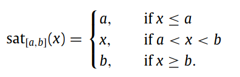

## 提取gap
从当前的环境中提取gap list，核心思想是从连续深度中寻找不连续的深度点。
### 寻找深度不连续点
**根据机器人的形状定义机器人的最小通行宽度$\omega_{min}$**
对于两个不连续点$(P_i, P_j)$，满足下面两个判断条件的中的一个：
1. $P_i$和$P_j$之间的距离大于$\omega_{min}$ 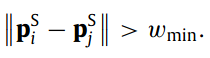。这种点之间有两个端点，可以称为**双边不连续gap**，对于双边不连续的点，**basis**是更接近机器人当前位置$p_r$的端点。
   
2. $P_i$或者$P_j$点大于传感器的最大感知范围，描述位非障碍物点(non-obstacle point)。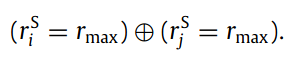，这种点成为**单边不连续gap**，单边不连续点的**basis**是它唯一的端点。

3. 如何将不连续点划分为左侧右侧：
   - 单边不连续点: 单边不连续点的基点位于非障碍物的右侧，就是右不连续点；反之亦然。
   - 双边不连续点：双边不连续点的基点位于另一个端点的右侧，就是右不连续点；反之亦然。
   - 不连续点的方向就是basis点在gap的左侧，就是左不连续点，basis在右侧，就是右不连续点。
    不连续点方向判断如下图所示：
    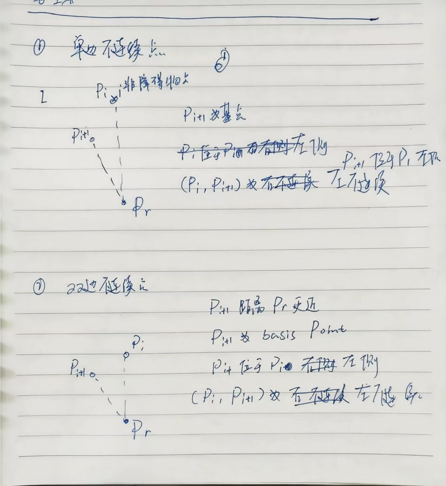

**整体图解：**
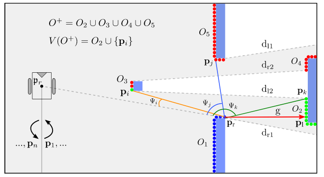
图中存在四个障碍物，划分为5段连续深度，使用$O_1, O_2, O_3, O_4, O_5$表示。其中由$O_3, O_4$组成的不连续深度$d_{r2}$和由$O_3, O_2$组成的不连续深度$d_{l2}$是双边不连续深度.其他同理。

## 搜寻gap(gap search)
gap search的过程重复两次，顺时针进行一次，逆时针进行一次。
**逆时针搜索**
逆时针搜索时使用深度判断的方法计算右不连续点，下面是搜索左不连续点的过程。
1. 检查每两个深度点之间是否存在**右不连续点**，寻找gap在basis点右侧的gap，表示为$P_r(g)$.
2. 计算每个gap的左边界，检查两个深度点之间是否存在**左不连续点**：
   - 将找到的$P_r(g)$作为分界点，左侧的所有的osbtacle points作为一个集合$O^+$, 并且左侧的点集距离$P_r(g)$的角度范围为$[0, pi]$. 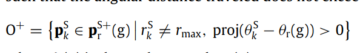
   - 遍历$O^+$中的所有障碍物点，取第i个点为$P_i$, 构建一个由$p_r(g)$和$p_i$组成的gap，判断当前的gap是否能够被当前机器人位置$P_r(g)$观测到，根据能否被观测到给一个label of valid or invalid。观测的判断方法是当前的 **右不连续点$P_r(g)$** 与 **当前的判断的点$P_i$** 的连线上没有任何的障碍物点或者封闭区域。对于符合这个条件的点 **$P_i$**,定义这个点与右不连续点$P_r(g)$的角度为$P_i$相对于右不连续点$P_r(g)$的可见角度。可见角度的计算公式为：
    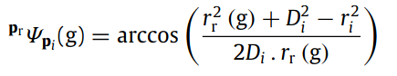
    可见角度的推导过程如图所示：
    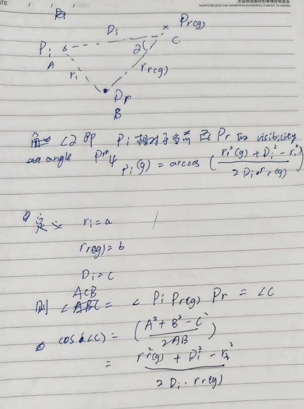
    **如果满足下面的条件，则当前点$P_i$为valid:**
    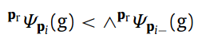
    其中：
    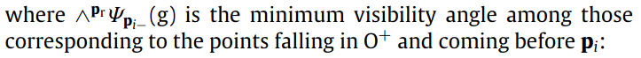
    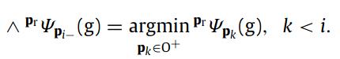
    也就是说，只要当前点的可视角度比之前的所有的可视角度小，那么这个点就是有效的。
3. 在所有有效的障碍物点中，选取距离**右不连续点$P_r(g)$**最近的点障碍物点，记作$V(O^+)$. 这个$V(O^+)$就是左不连续点。
4. 如果不存在左不连续点，就需要构造一个虚拟点来充当左不连续点。如果当前的不连续点不存在左不连续点，那么左不连续点被按照下面的方式设置：
   - 距离等于 $R+d_{safe}$, 机器人半径加上安全距离
   - 角度等于右不连续点$P_r(g)$的左侧邻居的方向
5. 从左不连续点$P_l(g)$开始搜索其他的gap
6. 将逆时针搜索的间隙使用$V_{cc}$表示。

**图解分析**
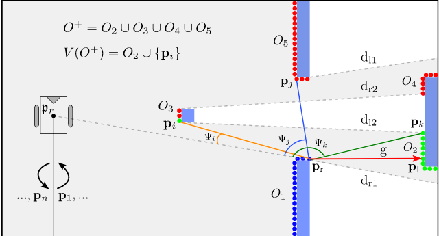
如上图所示是一次逆时针搜索的过程，根据基础点(basis point) $d_{r1}$建立了gap g，其中点$d_{r1}$表示为$P_r$.
图中的绿色点表示有效点，红色点表示无效点。
比如点$P_i$是有效的，因为该点相对于机器人当前位置与$P_r$点之间的可视角度小于所有$P_i$点右侧所有障碍物的可视角度。无效点是就是可视角度比右侧所有点的最小可视角度还要小。即说明当前的点i与基准点$P-r$之间的连线经过了障碍物或者被遮挡。

**顺时针搜索**
顺时针搜索与逆时针搜索的过程类似，但是方向与逆时针搜索相反，在顺时针搜索时使用深度不连续来创建左不连续点，使用刚才相同的判断方法来计算右不连续点。建立gap集合表示为$v_c$

**最终的所有gap**
最终的所有gap使用$V = V_c \cup V_{cc}$

## gap 缩减 Gaps reduction
AG算法只考虑直接面向机器人的间隙，忽略其他间隙。如果一个间隙导致另一个间隙，仅考虑第一个间隙。
在之前search gaps部分找到的gaps集合V中，根据传感器的布置形式，将gaps划分为前间隙(front gaps)和后间隙(rear gaps).前间隙的判断条件为$|\theta_l(g) - \theta_r(g)| <= \pi$。
如果$gap_r$和$gap_j$是同一种类型(前间隙或者后间隙)，并且$gap_j$处于$gap_r$中，那么$gap_j$可以被$gap_r$达到。
**$gap_j$可以被$gap_r$达到的判断条件是：**
1. 对于前间隙(front gap)：
   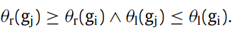
2. 对于后间隙(rear gap):
   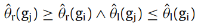
   其中：
   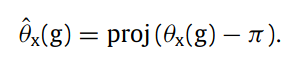
   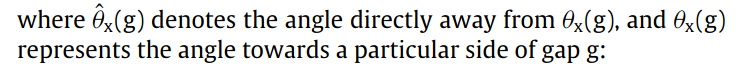

**从gap的集合V中删除所有可以被到达(reach)的间隙**，论文中表示为：
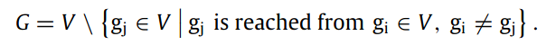

**图解过程**
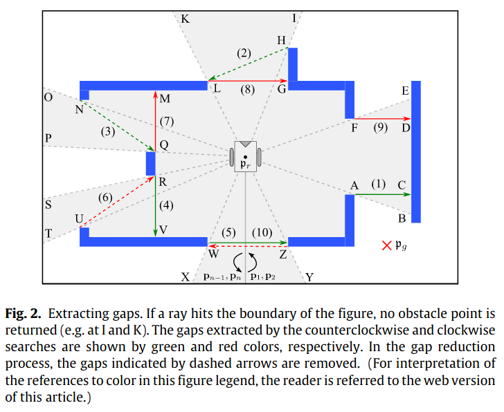

这种方法提取的间隙数目更小，避免了不正确的间隙。

## 允许间隙(admissible gap)
**PS: 这里的表示间隙的符号$P_l(g)$ 简写为$P_l$.**
1. 动力学约束 kinematic constraints
   文章中以差速机器人为例，其运动学约束为：
   $-\dot{x} \sin \theta + \dot{y} \cos \theta = 0$, 其中$(x, y, \theta)$表示机器人的x, y和yaw角
   差速机器人的运动学约束可以表示为：
   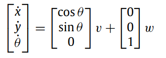
   根据动力学约束，可以使用一系列的圆弧来近似机器人的轨迹，圆弧的圆心位于Y轴上。表示为下面的形式：
   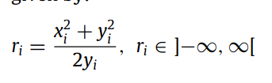
   在差速机器人的运行过程中，可以使用下面的图形进行表示：
   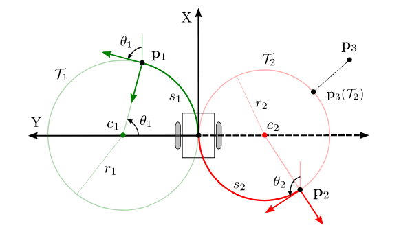

2. 基于动力学约束的gap traversal
   驱动机器人通过gap g，实现长度和安全通过的折中。
   - 给gap g 设定一个 subgoal $P_s$，让机器人沿着他一个边界$P_c$移动
   - 绕行$P_c$时，机器人与$P_c$保持一个合适的安全距离$d_s$，同时朝向g的方向前进。其中$d_s$是间隙的宽度决定的:
       - 比较窄的间隙时： $d_s = 0.5 * width_{gap}, width_{gap} = ||p_l - p_r||$
       - 比较宽的间隙时： $d_s = R + d_{safe}$
   - 如何识别$p_c$
 
pass

## AG 避障方法 AG obstacle avoidance method
基本思想是首先判断当前机器人位置能否直接到达目标，如果不可以直接到达目标，那么就被引导至间隙而不是目标本身。
选择距离机器人最近的间隙，进行可导航性检查，如果不可以导航，就选择另一个间隙。不断重复这个过程，直到找到可以通过的间隙或者确定不存在可通过的间隙。

### 间隙可导航性检查 gap navigability check
如果机器人可以安全的从间隙$p_r$通过，那么这个间隙就是navigable的。
根据之前的定义：
- admissible gap 可接受的gap是可以导航的 navigable
- non-admissible gap 也可以是可导航的 navigable, 如果

