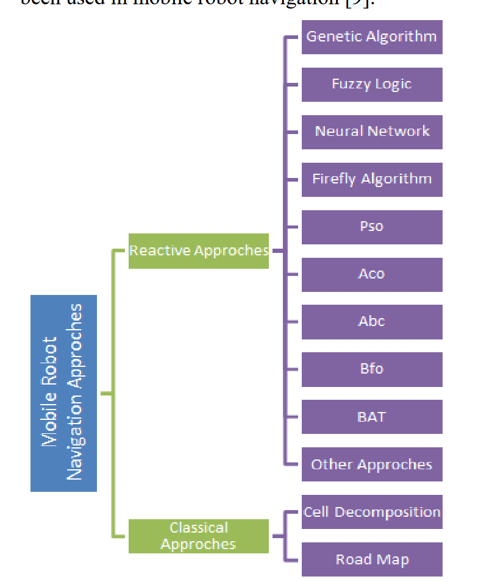
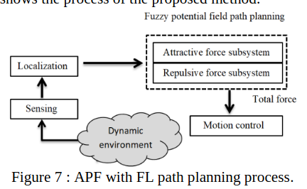

# Assessment and Review of the Reactive Mobile Robot Navigation
传统的导航方法分为两类：经典的规划式导航和反应式导航。经典规划问题对于不确定环境难以适应，因此反应式导航在不确定环境与动态环境中具有较好的适应性。
**反应式导航方法的分类**

## 遗传算法(GA)
pass

## 模糊控制(fuzzy logic)
[19] M. Al-Khatib and J. J. Saade, ‘An efficient data-driven fuzzy approach to the motion planning problem of a mobile robot’, Fuzzy sets and systems, vol. 134, no. 1, pp. 65–82, 2003.
提出了一种模糊控制逻辑，对于动态环境多个障碍物找到最佳或者较好的路径规划。
提出了两个模糊势场，用以解决动态环境的动态障碍物和静态障碍物的避障问题。
[20] M. A. K. JaradYuan等人[26]提出了一种神经网络作为移动设备在大卖场传输产品的解决方案。at, M. H. Garibeh, and E. A. Feilat, ‘Autonomous mobile robot dynamic motion planning using hybrid fuzzy potential field’, Soft Comput, vol. 16, no. 1, pp. 153–164, Jan. 2012, doi: 10.1007/s00500-011-0742-z.
提出了一种将模糊控制与人工势场法(APF)进行结合的方法：
机器人到障碍物的距离和速度被视为势场的排斥力和吸引力。x和y是模糊控制器的输入和输出。

Liu, Y et al [24] used a fuzzy logic to propose a method for dynamic obstacle avoidance without changing the rout. This was performed by changing the velocity of the mobile robot depending on distance, velocity, and direction of obstacles toward the mobile robot. Whereas the mobile robot may approach to move away from the obstacle or stop and wait for the obstacle pass through. Figure (8) explains a block diagram of suggested procedure.
Liu，Y等人[24]使用模糊逻辑提出了一种在不改变路线的情况下动态避障的方法。这是通过根据障碍物朝向移动机器人的距离、速度和方向改变移动机器人的速度来实现的。而移动机器人可能会接近并远离障碍物，或者停下来等待障碍物通过。图 (8) 解释了建议程序的框图

## 深度学习(DL)
D. Janglová, ‘Neural networks in mobile robot motion’, International Journal of Advanced Robotic Systems, vol. 1, no. 1, p. 2, 2004.
这篇文章作者使用了两个NN网络来进行路径规划，Janglová 等人[25]引入了两个神经网络来解决路径规划问题。第一个神经网络用于发现空间，第二个神经网络用于路径查找。第一个神经网络使用超声波传感器来确定自由空间，而机器人则被建模为工作空间中的二维物体。第二个神经网络用于查找到达目标的路径。仿真是通过使用C++环境来实现的。实时实验表明该程序可以找到尽可能短的解决方案。 
这个思路还是挺有趣的。

## 粒子群优化(Particle Swarm Optimization PSO)
pass

## Bacterial Foraging
pass

## Bee Colony
pass

## Firefly Algorithm