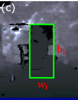
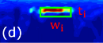

# Onboard dynamic-object detection and tracking for  autonomous robot navigation with RGB-D camera （TODO）
there three problems of mobile robot obstacle detection and tracking:
- onboard computatioon resources is limited, deeplearning methods are not applicable
- the depth camera's FOV is limited, make obstacle detection difficult
- the noise of depth camera is high

**based the above three problrms, the author presents 3D dynamiv obstacle detection and tracking(DODT) based on RGB-D camera**

to compare with other methods which use **sigle detoctor**, 
the author presents a **multi-detector** to obstain fast and accurate obstracle detection

**The authort presents three novel contributions:**
- efficient ensemble detection by combaining mutli-detectors
- feature-based association and tracking
- Auxiliary Learning-based Detection Module

## related work
**Pointcloud based method**
1. Combain YOLO and PCL for human detection----T. Eppenberger, G. Cesari, M. Dymczyk, R. Siegwart, and R. Dub ́e, “Leveraging stereo-camera data for real-time dynamic obstacle detection and tracking,” in 2020 IEEE/RSJ International Conference on Intelligent Robots and Systems (IROS). IEEE, 2020, pp. 10 528–10 535.
2. clustering-based detection for indoor dynamic obstacle avoidance [Autonomous flights in dynamic environments with onboard vision]
3. point cloud feature vectors and object track points to identify correct object matches and estimate their states
4. KD-Tree map is directly constructed from the LiDAR point cloud for dynamic obstacle avoidance [Avoiding dynamic small obstacles with onboard sensing and computation on aerial robots]
## System Review 
**The system can be disilluted into three parts:**
- Pointcloud and image input
- Mutli-detector for obstacles detection, which  departed into two parts: Non-learning detection and Learning-based detection.
- Obstacle association and tracking
- Dynamic obstacle indentication
- Remove dynamic obstacles from map
- Output dynamic osbtacles
### 3D-osbtacle detector
Three methods obstacle detector are presented:
- **U-depth**
- **DB-SCAN**
- **YOLO-MAD**
And all detectors return axis-aligned bounding box(AABB)
#### U-depth
[U-depth](https://github.com/uf-robopi/UDepth)
U depth map is a point cloud map which dipicts the depth of the x y plane. V-depth map dipicts the depth of the z y plane.
**the anthor presents three U-depth map obstacle detectors:**
- H. Oleynikova, D. Honegger, and M. Pollefeys, “Reactive avoidance using embedded stereo vision for mav flight,” in 2015 IEEE International Conference on Robotics and Automation (ICRA). IEEE, 2015, pp. 50–56.
- J. Lin, H. Zhu, and J. Alonso-Mora, “Robust vision-based obstacle avoidance for micro aerial vehicles in dynamic environments,” in 2020 IEEE International Conference on Robotics and Automation (ICRA). IEEE, 2020, pp. 2682–2688.
- A. Saha, B. C. Dhara, S. Umer, K. Yurii, J. M. Alanazi, and A. A. AlZubi, “Efficient obstacle detection and tracking using rgb-d sensor data in dynamic environments for robotic applications,” Sensors, vol. 22, no. 17, p. 6537, 2022.

**FOUR steps for U-depth Dectectors**
1. U-depth map generation
2. line grouping on U-depth map
3. depth continuity search on original depth image
4. coordinate transformation

U-depth map can be viewed as the **top-down view** from camera.
the original depth image:

the U-depth map image:

the U-depth image has same width with orginal depth image, the height indciates the distance from camera. So we can get obstacles thicnkness by the height of U-depth map.
when get a depth image, we can compute U-depth map by **computing column depth value histogram.**

When compute U-depth map, the author use **line grouping method**
to get 2D bounding box width of the obstacle $w_i$ and the thickness of the obstacle $t_i$, as shown in upper figure.

After getting obstacle $w_i$, use **continuity check** on original depth iamge to get  obstacle height $h_i$.

Transfrom obstacle to world/map coordinate.

##### the present U-depth methods

