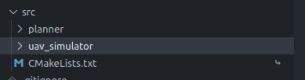
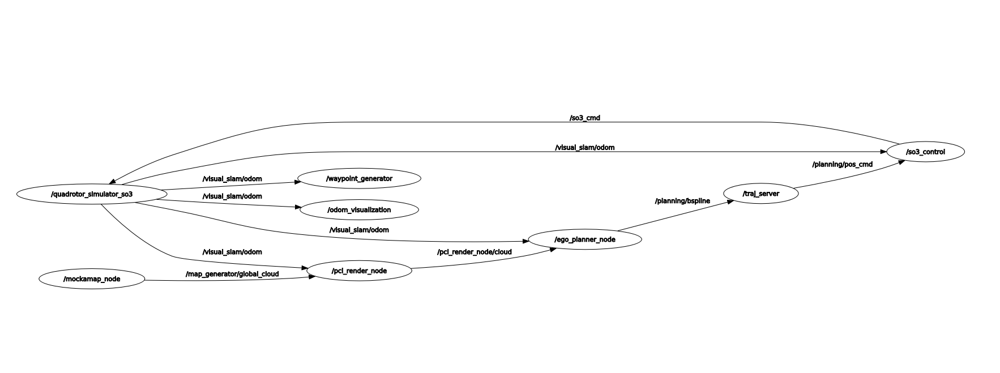
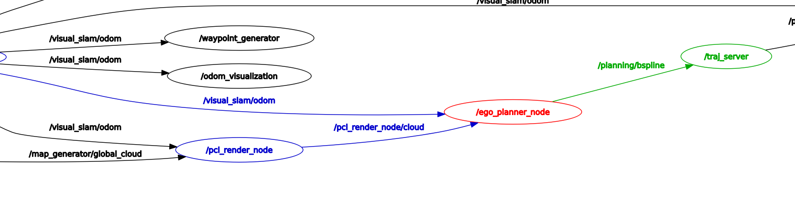

# 代码结构分析

ego palnner的代码结构分为两个部分，一个是planner，一个是sims。规划的主要程序都在planner中，sims中主要是一些仿真程序，比如模拟器，以及一些可视化程序以及点云体素化地图。

# 代码rqt_graph

ego_planner主要部分是ego_planner_node和/traj_server，/traj_server主要用来发布轨迹，ego_planner_node主要用来发布轨迹，以及发布一些可视化信息。
**1. ego_planner_node**

ego_planner_node接受两个话题，一个为当前的odom信息，一个为当前的局部的点云的体素地图。输出一个b样条曲线给到轨迹规划器中。
# 仿真安装及代码测试
这里需要指定docker的可视化界面到物理机上
```bash
docker run -it \
    -e DISPLAY=$DISPLAY \
    -e XDG_RUNTIME_DIR=/tmp/runtime-$UID \
    -v /run/user/$UID:/tmp/runtime-$UID \
    -v /tmp/.X11-unix:/tmp/.X11-unix \
    --name ego_planner \
    rgo-planner:latest
```
进入docker之后默认用户如果为root用户，需要将root用户切换为ubuntu，使用
```bash
sudo su - ubuntu
```
进入ubuntu用户之后，启动相关的启动文件就可以启动相关的可视化界面了。

