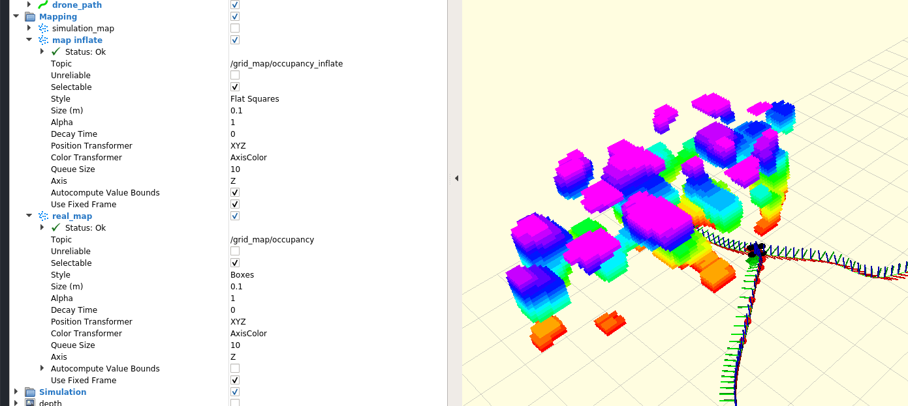

# 代码实现功能
这部分代码实现了一个使用odom和深度相机点云，构建了一个三维的体素地图，用于后续的导航避障。

这部分代码中一共有三个pub函数，`  ros::Publisher map_pub_,map_inf_pub_;ros::Publisher unknown_pub_;`
分别发布了占据地图，代价地图和位置发布。

# 局部代价地图的发布
其中`map_inf_pub_`为
` map_inf_pub_ = node_.advertise<sensor_msgs::PointCloud2>("/grid_map/occupancy_inflate", 10);`
发布了局部的代价地图。

这个局部代价地图是从全局地图中截取一部分获得的，因此这个局部代价地图不能够实时的反映动态环境的变化，对于动态环境的适应性较差。

