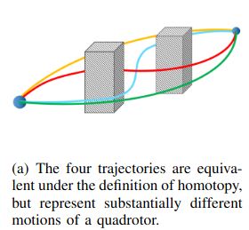
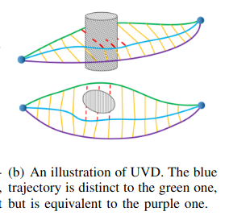

# Robust Real-time UAV Replanning Using  Guided Gradient-based Optimization and Topological Paths
本文提出了PGOP算法，通过优化路径规划算法来优化UAV的规划路径，以实现更稳定的路径规划。

目前方法的局限：
1. 传统的gto方法在局部最优的问题上表现不佳
2. 高速动态环境表现不佳

本文提出了两个创新点:
1. 一个两阶段的优化方法，粗优化是哟哦嗯拓扑路径进行引导获得一条路径，然后使用ESDF进行进一步的优化
2. 在拓扑路径上在进行进一步的优化

## 关于拓扑等价关系
定义：两条参数化轨迹τ1(s)和τ2(s)，其中s∈[0,1]，且满足τ1(0)=τ2(0)和τ1(1)=τ2(1)，如果对于所有s，线段τ1(s)τ2(s)是无碰撞的，则它们属于同一UVD类。
与可见性变形（VD）的关系：UVD是VD的一个子集，两者都定义了一个从一条路径到另一条路径的连续映射，其中一条路径上的点通过直线映射到另一条路径上的点。主要区别在于，对于UVD，点τ1(s1)映射到τ2(s2)，其中s1=s2，而对于VD，s1不一定等于s2。因此，UVD在实践中捕捉了稍微多一点的路径类，并且等价性检查的效率更高。

论文使用基于UVD的采样方法来构建拓扑路线图（Topological Roadmap），该路线图捕捉了环境中不同UVD类的路径。
通过在拓扑路线图中进行深度优先搜索，可以找到从起点到终点的多条拓扑上不同的路径。

对于从拓扑路线图中找到的冗长或绕远的路径，使用算法进行缩短和修剪，以生成更短的、拓扑上等价的路径。
这有助于在轨迹优化的第一阶段生成更平滑的“热身轨迹”，从而提高后续优化的效率和效果。

## 什么是拓扑等价关系呢？

这四条轨迹在拓扑tongyu的情况下是等价的，但是不是UDV等价的

绿色轨迹和蓝色轨迹不等价，蓝色轨迹和紫色轨迹是等价的。

**拓扑等价关系可以这样子表述，就是开始点和结束点是一致的，中间轨迹能够无碰撞的变形到另一条轨迹，则这两条轨迹就是拓扑等价关系**