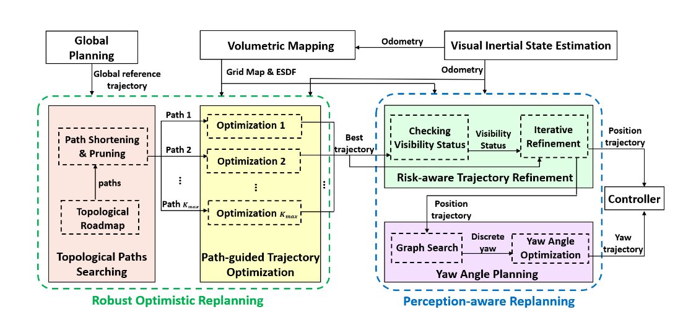

# RAPTOR: Robust and Perception-aware Trajectory  Replanning for Quadrotor Fast Flight
轨迹重规划能够让四旋翼在未知环境中自主导航，但是在高速环境下轨迹重新规划是一个问题。在时间非常有限的情况下，现有方法对解的可行性或质量没有强有力的保证。此外，大多数方法没有考虑环境感知，而环境感知是快速飞行的关键瓶颈。在本文中，我们提出了RAPTOR，一个鲁棒的和感知感知的重规划框架来支持快速和安全的飞行，系统地解决了这些问题。

**设计了一种融合多条拓扑路径的路径引导优化( PGO )方法，以确保在非常有限的时间内找到可行且高质量的轨迹。**

**我们还引入了感知感知规划策略来主动观察和避开未知障碍物**。

Nonetheless, high-speed flight in unknown and highly cluttered environments still remains one of the biggest challenges toward full autonomy.
高速飞行和高度动态的环境仍然是是一个挑战。

**在高速环境中的运动存在以下几个问题：**
- 有限时间快速进行重规划
- 快速重规划过程中，在限制的拓扑类中不一定存在最优的解
- 现有方法对环境感知不敏感，当飞行速度和障碍物密度较高时，会造成致命的后果。
- 主动观察并避免可能出现的危险，而不是被动地躲避观察到的东西，对于安全的高速飞行是至关重要的

In this paper, we propose a Robust And Perception-aware TrajectOry Replanning framework called RAPTOR to address these issues systematically

为了弥补这一差距，我们将其扩展为感知感知规划策略，从两个方面实现更快、更安全的飞行
perception-aware planning strategy

本文的主要的内容：
- A topological paths-guided gradient-based replanning approach, that is capable of generating high-quality trajectories in limited time. 一个基于梯度的拓扑轨迹引导规划，能够在短时间内快速的生成高质量的路径
- A risk-aware trajectory refinement approach, which enforces visibility and safe reaction distance to unknown obstacles. It improves the predictability and safety of fast flights.一个风险感知的轨迹规划方法，能够在未知区域增强对可见性和安全距离，提高快速安全的飞行
- A two-step yaw angle planning method, to actively explore the unknown environments and gather useful information for the flight. 两步的yaw角规划，为飞行提供足够的FOV信息

## SYSTEM OVERVIEW

It takes the outputs of the global planning, dense mapping and state estimation modules, and deforms the global reference trajectory locally to avoid previously unknown obstacles.
获得全局规划的输出，稠密映射和状态估计模块的信息，并且对全局参考系进行变形以避开未知障碍物。

**整个重规划分为两步进行工作**
- Firstly, the robust optimistic replanning generates multiple locally optimal trajectories in parallel through the path-guided optimization (Sect.IV).通过路径引导优化的鲁棒重规划，在可通行区域生成局部的优化路径。The optimization is guided by topologically distinctive paths extracted and carefully selected from the topological path searching, which will be detailed in Sect.优化路线是通过挑选的拓扑路线进行搜索引导的。
- Secondly, the perception-aware planning strategy is utilized.The best trajectory among the locally optimal ones is further polished by a risk-aware trajectory refinement, in which its safety and visibility to the unknown and dangerous space is improved, as presented in Sect.VI.第二步对感知模块进行优化，通过感知信息获得更优的yaw角约束。
