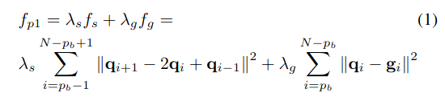
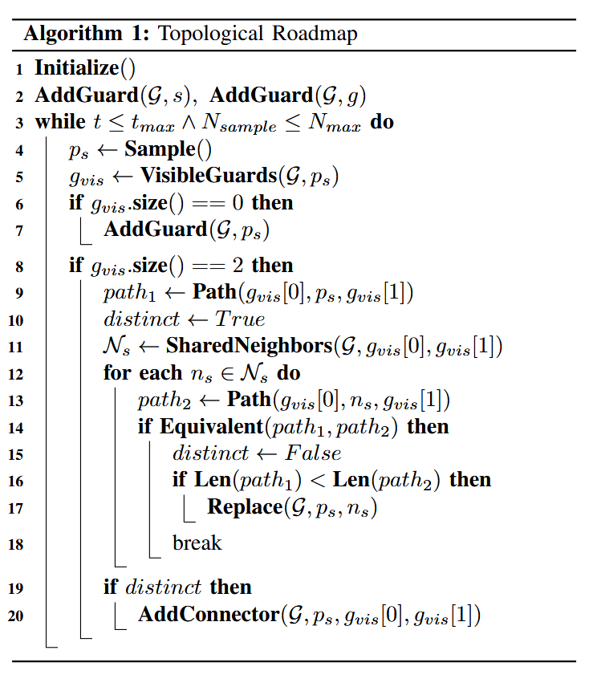
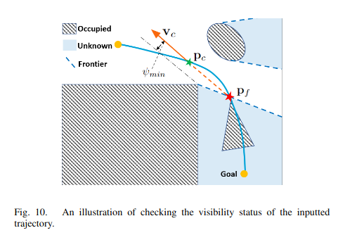

# RAPTOR: Robust and Perception-aware Trajectory  Replanning for Quadrotor Fast Flight
轨迹重规划能够让四旋翼在未知环境中自主导航，但是在高速环境下轨迹重新规划是一个问题。在时间非常有限的情况下，现有方法对解的可行性或质量没有强有力的保证。此外，大多数方法没有考虑环境感知，而环境感知是快速飞行的关键瓶颈。在本文中，我们提出了RAPTOR，一个鲁棒的和感知感知的重规划框架来支持快速和安全的飞行，系统地解决了这些问题。

**设计了一种融合多条拓扑路径的路径引导优化( PGO )方法，以确保在非常有限的时间内找到可行且高质量的轨迹。**

**我们还引入了感知感知规划策略来主动观察和避开未知障碍物**。

Nonetheless, high-speed flight in unknown and highly cluttered environments still remains one of the biggest challenges toward full autonomy.
高速飞行和高度动态的环境仍然是是一个挑战。

**在高速环境中的运动存在以下几个问题：**
- 有限时间快速进行重规划
- 快速重规划过程中，在限制的拓扑类中不一定存在最优的解
- 现有方法对环境感知不敏感，当飞行速度和障碍物密度较高时，会造成致命的后果。
- 主动观察并避免可能出现的危险，而不是被动地躲避观察到的东西，对于安全的高速飞行是至关重要的

In this paper, we propose a Robust And Perception-aware TrajectOry Replanning framework called RAPTOR to address these issues systematically

为了弥补这一差距，我们将其扩展为感知感知规划策略，从两个方面实现更快、更安全的飞行
perception-aware planning strategy

本文的主要的内容：
- A topological paths-guided gradient-based replanning approach, that is capable of generating high-quality trajectories in limited time. 一个基于梯度的拓扑轨迹引导规划，能够在短时间内快速的生成高质量的路径
- A risk-aware trajectory refinement approach, which enforces visibility and safe reaction distance to unknown obstacles. It improves the predictability and safety of fast flights.一个风险感知的轨迹规划方法，能够在未知区域增强对可见性和安全距离，提高快速安全的飞行
- A two-step yaw angle planning method, to actively explore the unknown environments and gather useful information for the flight. 两步的yaw角规划，为飞行提供足够的FOV信息

## SYSTEM OVERVIEW

It takes the outputs of the global planning, dense mapping and state estimation modules, and deforms the global reference trajectory locally to avoid previously unknown obstacles.
获得全局规划的输出，稠密映射和状态估计模块的信息，并且对全局参考系进行变形以避开未知障碍物。

**整个重规划分为两步进行工作**
- Firstly, the robust optimistic replanning generates multiple locally optimal trajectories in parallel through the path-guided optimization (Sect.IV).通过路径引导优化的鲁棒重规划，在可通行区域生成局部的优化路径。The optimization is guided by topologically distinctive paths extracted and carefully selected from the topological path searching, which will be detailed in Sect.优化路线是通过挑选的拓扑路线进行搜索引导的。
- Secondly, the perception-aware planning strategy is utilized.The best trajectory among the locally optimal ones is further polished by a risk-aware trajectory refinement, in which its safety and visibility to the unknown and dangerous space is improved, as presented in Sect.VI.第二步对感知模块进行优化，通过感知信息获得更优的yaw角约束。

## PATH-GUIDED TRAJECTORY OPTIMIZATION 路径引导的轨迹优化
在section 2-A中，GTO方法在局部路径规划中速度非常快，但是存在路径的极小点问题。
针对上述问题，本文提出了PGO算法，使用几何路径规划来提高生成路径的成功率。
### 优化失效分析
GTO会由于初始规划的不合适导致规划的失败，传统在解决这个问题时会添加欧氏距离作为约束，但是添加距离约束之后还是会有局部最优的现象。
### problem formulation 问题界定
使用B样条曲线作为基础的规划曲线，是一个低消耗的曲线规划。
For a trajectory segment in collision, we reparameterize it as a pb degree uniform B-spline with control points {q0, q1, . . . , qN } and knot span ∆t.
对于一段轨迹，将这段轨迹的B样条设置为一个包含（q_0, q_1, ..., q_N）的控制点和knot span ∆t

**PGO包含两种不同的相**
1. **生成一段 intermediate warmip trajectory**
也就是用环境的信息来变形轨迹而不是单独的使用ESDF,本文使用几何路径引导，将初始的轨迹引导到自由空间上。
本文中的工作中，无碰撞的轨迹是哟欧基于采样的拓扑路径搜索实现的。
第一阶段的目标函数为：

f_S是平滑项，f_g是平滑代价。平滑代价的计算方式是引导路径点到样条曲线之间的距离。
简化fs的形式，通过B样条的方法来简化fs的计算形式。
每个控制点qi在引导路径上分配一个关联点gi，gi沿引导路径均匀采样。然后将fg定义为这些点对之间的平方欧氏距离之和。
It outputs a smooth trajectory in the vicinity of the guiding path.会生成一条基本上大部分无碰撞的初始轨迹，论文中叫热身轨迹。使用这种方法能够将大部分的轨迹放置到无障碍的空间中，在使用标准的GTO算法来优化提升轨迹。Hence, standard GTO methods can be utilized to improve the trajectory.
2. **轨迹的进一步平滑**
将预热轨迹进一步细化为平滑、安全、动态可行的轨迹，使用B样条曲线进行优化

由于第一步有了一个较好的轨迹，因此第二步能够较快的进行优化。

### TOPOLOGICAL PATH SEARCHING 拓扑路径搜索
However, this trajectory is restricted within a topologically equivalent class and not necessarily satisfactory, even with the guidance of the shortest path, as seen in Fig. 8(e) and 8(f).
但是这个路径并不是一个全局最优的，即使在最短路径的引导下依然不是。同时，由于机器人运动的多种速度与加速度叠加，因此最优路线也难以评估。
本文提出的解决方法是使用基于采样的拓扑路径搜索来实现在空间中的快速检索。

#### Topology Equivalence Relation 拓扑等价关系
**拓扑等价关系**
本文添加了一种新的拓扑等价关系，对于空间中的拓扑等价关系(VD)，添加一个额外的约束Based on VD, we define uniform visibility deformation (UVD), which also captures abundant useful trajectories, and is more efficient for equivalence checking.

**拓扑路图 topo roadmap**

这个算法相比标准的PRM方法构建出冗余的拓扑路线图，这个方法能够构建出更加紧凑的路线图。
拓扑路线图包含两个部分，一个是图的节点 node，在论文中表示为保护节点(guard node)和图的边，论文中表示为(conntecor).，保护节点图和连接节点图，guard node and connector。
The guards are responsible for exploring different part of the free space, and any two guards g1 and g2 are not visible to each other (line g1g2 is in collision).
guards 代表探索自由空间中的不同部分，并且两个守卫节点互相不可见。

在程序初始化阶段，在开始点和结束点创建了两个保护点

Every time a sampled point is invisible to all other guards, a new guard is created at this point (Line 6-7)
每当一个采样点对其他采样点不可见时，就在这个采样点创建新的守卫节点

当图中的节点数大于2时，就使用连接器创建两个节点的之间连线作为path

当一个采样点恰好对两个保护可见时，创建一个新的连接器，或者连接保护以形成拓扑不同的连接(第19 ~ 20行)，或者替换现有的连接器以形成更短的路径( Line 1617 )。

Limits of time (tmax) or sampling number (Nmax) are set to terminate the loop.
程序将在最大的循环次数之后结束

通过这个循环，程序建立一个深度优先的的路线。

**路径缩短和修剪**
由于PGO的过度优化和变形，一些路径是绕远的。
Hence, Alg. 2 find a topologically equivalent shortcut path Ps for each Pr found by the depth-first search (illustrated in Fig. 9).
算法二寻找每一个路径P_r的等效路径P_s

For this reason, we only select the first Kmax shortest paths. Paths more than rmax times longer than the shortest one are also pruned away. Such strategies bound the complexity and will not miss the potentially optimal solution, because a very long path is very unlikely to result in the optimal trajectory.

因此，我们仅选择第一个kmax最短路径。路径比最短的路径长于最短的路径。这种策略构成了复杂性，不会错过潜在的最佳解决方案，因为很长的路径极不可能导致最佳轨迹。

### 基于风险感知的轨迹优化 RISK-AWARE TRAJECTORY REFINEMENT
我们的轨迹改进从平行的PGO PI（T）中获得最佳的轨迹作为输入，将其修改为附近，并输出精制的轨迹PR（t）（在ALG.3中详细介绍）。它首先检查PI（t）的可见性状态，之后，在迭代细化中对相关未知空间的可见性和安全反应距离进行了实施。
将搜索到的拓扑路径进行优化，然后使用未知空间可见性和安全距离等进行更进一步的优化
#### 检查可见性
可见状态包含以下几个状态：
$t_f$
$P_f$
$t_c$
$P_c$
$V_c$

#### 迭代优化Iterative Refinement

### YAW ANGLE PLANNING yaw角的进一步优化
对偏航角进行进一步的优化
