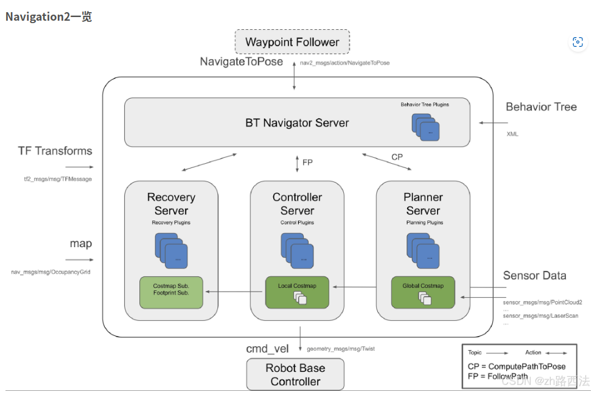
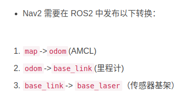
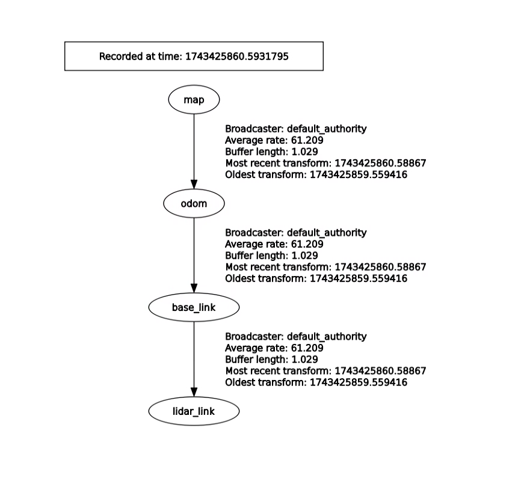
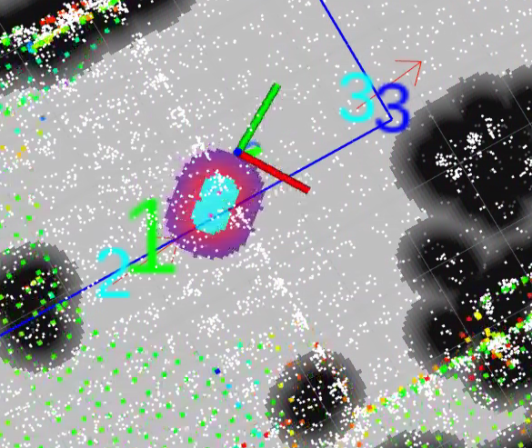
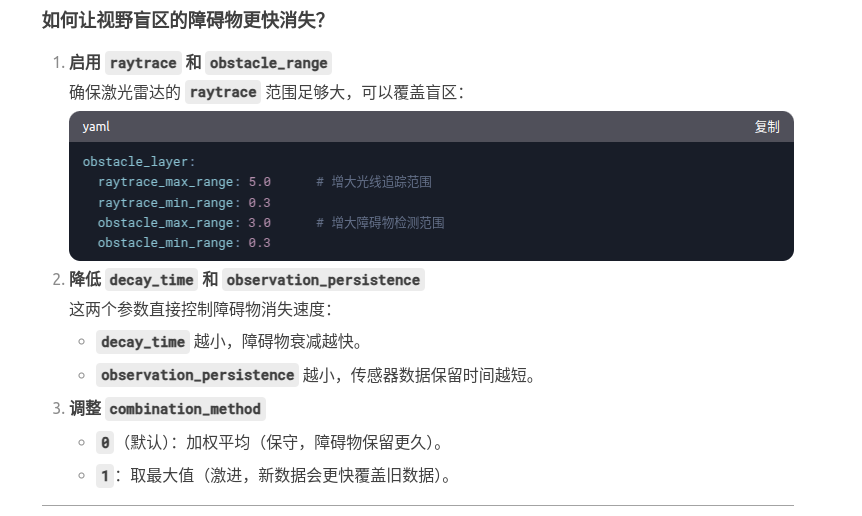

# nav2与定位程序结合


nav2所需要的tf变换关系


20250331
由于坐标系之间的转换关系比较复杂，目前是直接将fuse_pose的参数订阅出来，重新发布为自己的坐标系。坐标之间的关系为

```python
#!/usr/bin/env python3
import rclpy
from rclpy.node import Node
from geometry_msgs.msg import PoseStamped, PoseWithCovarianceStamped
from nav_msgs.msg import Odometry
from tf2_ros import TransformBroadcaster
from geometry_msgs.msg import TransformStamped
import math

class PoseToTFNode(Node):
    def __init__(self):
        super().__init__('pose_to_tf_node')
        
        # 创建TF广播器
        self.tf_broadcaster = TransformBroadcaster(self)
        
        # 订阅fuse_pose话题
        self.pose_sub = self.create_subscription(
            Odometry,
            '/fuse_pose',
            self.pose_callback,
            10
        )
        
        # 创建自定义定位消息发布器，避免与原始fuse_pose冲突
        self.localization_pub = self.create_publisher(
            PoseWithCovarianceStamped,
            '/robot_pose',
            10
        )
        
        self.get_logger().info('PoseToTF node initialized. Subscribing to /fuse_pose')
        
    def pose_callback(self, msg):
        # 获取当前时间，确保所有TF使用相同时间戳
        current_time = self.get_clock().now().to_msg()
        
        # 准备发布的TF变换列表
        transforms = []
        
        # 1. 发布 map 到 odom 的变换
        t_map_odom = TransformStamped()
        t_map_odom.header.stamp = current_time
        t_map_odom.header.frame_id = 'map'
        t_map_odom.child_frame_id = 'odom'
        
        # 将fuse_pose中的位置和方向赋给map到odom的变换
        t_map_odom.transform.translation.x = msg.pose.pose.position.x
        t_map_odom.transform.translation.y = msg.pose.pose.position.y
        t_map_odom.transform.translation.z = msg.pose.pose.position.z
        t_map_odom.transform.rotation = msg.pose.pose.orientation
        
        transforms.append(t_map_odom)
        
        # 2. 发布 odom 到 base_link 的变换 (恒等变换)
        t_odom_base = TransformStamped()
        t_odom_base.header.stamp = current_time
        t_odom_base.header.frame_id = 'odom'
        t_odom_base.child_frame_id = 'base_link'
        #!/usr/bin/env python3
import rclpy
from rclpy.node import Node
from geometry_msgs.msg import PoseStamped, PoseWithCovarianceStamped
from nav_msgs.msg import Odometry
from tf2_ros import TransformBroadcaster
from geometry_msgs.msg import TransformStamped
import math

class PoseToTFNode(Node):
    def __init__(self):
        super().__init__('pose_to_tf_node')
        
        # 创建TF广播器
        self.tf_broadcaster = TransformBroadcaster(self)
        
        # 订阅fuse_pose话题
        self.pose_sub = self.create_subscription(
            Odometry,
            '/fuse_pose',
            self.pose_callback,
            10
        )
        
        # 创建自定义定位消息发布器，避免与原始fuse_pose冲突
        self.localization_pub = self.create_publisher(
            PoseWithCovarianceStamped,
            '/robot_pose',
            10
        )
        
        self.get_logger().info('PoseToTF node initialized. Subscribing to /fuse_pose')
        
    def pose_callback(self, msg):
        # 获取当前时间，确保所有TF使用相同时间戳
        current_time = self.get_clock().now().to_msg()
        
        # 准备发布的TF变换列表
        transforms = []
        
        # 1. 发布 map 到 odom 的变换
        t_map_odom = TransformStamped()
        t_map_odom.header.stamp = current_time
        t_map_odom.header.frame_id = 'map'
        t_map_odom.child_frame_id = 'odom'
        
        # 将fuse_pose中的位置和方向赋给map到odom的变换
        t_map_odom.transform.translation.x = msg.pose.pose.position.x
        t_map_odom.transform.translation.y = msg.pose.pose.position.y
        t_map_odom.transform.translation.z = msg.pose.pose.position.z
        t_map_odom.transform.rotation = msg.pose.pose.orientation
        
        transforms.append(t_map_odom)
        
        # 2. 发布 odom 到 base_link 的变换 (恒等变换)
        t_odom_base = TransformStamped()
        t_odom_base.header.stamp = current_time
        t_odom_base.header.frame_id = 'odom'
        t_odom_base.child_frame_id = 'base_link'
        
        # 由于我们使用全局定位，odom到base_link的变换为恒等变换
        t_odom_base.transform.translation.x = 0.0
        t_odom_base.transform.translation.y = 0.0
        t_odom_base.transform.translation.z = 0.0
        t_odom_base.transform.rotation.w = 1.0
        
        transforms.append(t_odom_base)
        
        # 3. 发布 base_link 到 lidar_link 的变换
        t_base_lidar = TransformStamped()
        t_base_lidar.header.stamp = current_time
        t_base_lidar.header.frame_id = 'base_link'
        t_base_lidar.child_frame_id = 'lidar_link'
        
        # 根据激光雷达实际安装位置调整
        t_base_lidar.transform.translation.x = 0.0
        t_base_lidar.transform.translation.y = 0.0
        t_base_lidar.transform.translation.z = 0.2  # 假设激光雷达在底盘上方20cm
        t_base_lidar.transform.rotation.w = 1.0
        
        transforms.append(t_base_lidar)
        
        # 发布所有TF
        self.tf_broadcaster.sendTransform(transforms)
        
        # 发布自定义定位消息，供nav2使用
        robot_pose = PoseWithCovarianceStamped()
        robot_pose.header.stamp = current_time
        robot_pose.header.frame_id = 'map'
        robot_pose.pose.pose = msg.pose.pose
        
        # 从原始消息传递协方差信息（如果有）
        if hasattr(msg.pose, 'covariance'):
            robot_pose.pose.covariance = msg.pose.covariance
        
        self.localization_pub.publish(robot_pose)
        self.get_logger().debug('Published TF transforms and robot_pose')

def main():
    rclpy.init()
    node = PoseToTFNode()
    try:
        rclpy.spin(node)
    except KeyboardInterrupt:
        pass
    node.destroy_node()
    rclpy.shutdown()

if __name__ == '__main__':
    main()布 base_link 到 lidar_link 的变换
        t_base_lidar = TransformStamped()
        t_base_lidar.header.stamp = current_time
        t_base_lidar.header.frame_id = 'base_link'
        t_base_lidar.child_frame_id = 'lidar_link'
        
        # 根据激光雷达实际安装位置调整
        t_base_lidar.transform.translation.x = 0.0
        t_base_lidar.transform.translation.y = 0.0
        t_base_lidar.transform.translation.z = 0.2  # 假设激光雷达在底盘上方20cm
        t_base_lidar.transform.rotation.w = 1.0
        
        transforms.append(t_base_lidar)
        
        # 发布所有TF
        self.tf_broadcaster.sendTransform(transforms)
        
        # 发布自定义定位消息，供nav2使用
        robot_pose = PoseWithCovarianceStamped()
        robot_pose.header.stamp = current_time
        robot_pose.header.frame_id = 'map'
        robot_pose.pose.pose = msg.pose.pose
        
        # 从原始消息传递协方差信息（如果有）
        if hasattr(msg.pose, 'covariance'):
            robot_pose.pose.covariance = msg.pose.covariance
        
        self.localization_pub.publish(robot_pose)
        self.get_logger().debug('Published TF transforms and robot_pose')

def main():
    rclpy.init()
    node = PoseToTFNode()
    try:
        rclpy.spin(node)
    except KeyboardInterrupt:
        pass
    node.destroy_node()
    rclpy.shutdown()

if __name__ == '__main__':
    main()
```
并且将tf树重新发布。
在nav2的配置文件中，需要显式的指定当前的scan的话题的link为lidar_link
```yaml
local_costmap:
  local_costmap:
    ros__parameters:
      update_frequency: 5.0
      publish_frequency: 2.0
      global_frame: odom  # 使用odom作为局部代价地图的全局帧
      robot_base_frame: base_link  # 使用base_link作为机器人基础坐标系
      rolling_window: true
      width: 5
      height: 5
      resolution: 0.05
      robot_radius: 0.22
      plugins: ["obstacle_layer", "inflation_layer"]
      inflation_layer:
        plugin: "nav2_costmap_2d::InflationLayer"
        cost_scaling_factor: 3.0
        inflation_radiuobstacle_layer:
      #   plugin: "nav2_costmap_2d::ObstacleLayer"
      #   enabled: True
      #   observation_sources: scan
      #   scan:
      #     topic: /scan
      #     sensor_frame: "lidar_link" 
      #     max_obstacle_height: 2.0
      #     clearing: True
      #     marking: True
      #     data_type: "LaserScan"
      #     raytrace_max_range: 3.0
      #     raytrace_min_range: 0.0
      #     obstacle_max_range: 2.5
      #     obstacle_min_range: 0.0
      #     sensor_frame: lidar_link  # 明确指定传感器坐标系s: 0.55
        
      obstacle_layer:
        plugin: "nav2_costmap_2d::ObstacleLayer"
        enabled: True
        observation_sources: scan
        scan:
          topic: /scan
          sensor_frame: "lidar_link" 
          max_obstacle_height: 2.0
          clearing: True
          marking: True
          data_type: "LaserScan"
          raytrace_max_range: 4.0
          raytrace_min_range: 0.0
          obstacle_max_range: 2.5
          obstacle_min_range: 0.0
          sensor_frame: lidar_link  # 明确指定传感器坐标系
      
      always_send_full_costmap: True

global_costmap:
  global_costmap:
    ros__parameters:
      update_frequency: 1.0
      publish_frequency: 1.0
      global_frame: map
      robot_base_frame: base_link  # 使用base_link作为机器人基础坐标系
      robot_radius: 0.22
      resolution: 0.05
      track_unknown_space: true
      plugins: ["static_layer", "inflation_layer"]
      # obstacle_layer:
      #   plugin: "nav2_costmap_2d::ObstacleLayer"
      #   enabled: True
      #   observation_sources: scan
      #   scan:
      #     topic: /scan
      #     sensor_frame: "lidar_link" 
      #     max_obstacle_height: 2.0
      #     clearing: True
      #     marking: True
      #     data_type: "LaserScan"
      #     raytrace_max_range: 3.0
      #     raytrace_min_range: 0.0
      #     obstacle_max_range: 2.5
      #     obstacle_min_range: 0.0
      #     sensor_frame: lidar_link  # 明确指定传感器坐标系
      static_layer:
        plugin: "nav2_costmap_2d::StaticLayer"
        map_subscribe_transient_local: True
      inflation_layer:
        plugin: "nav2_costmap_2d::InflationLayer"
        cost_scaling_factor: 3.0
        inflation_radius: 0.55
      always_send_full_costmap: True
```

## nav2局部障碍物存在时间过长
nav2的导航默认参数障碍物的存在i时间会很长，通过修改局部障碍物存在时间来保证障碍物的快速消失

```yaml
local_costmap:
  local_costmap:
    ros__parameters:
      update_frequency: 5.0
      publish_frequency: 2.0
      global_frame: odom  # 使用odom作为局部代价地图的全局帧
      robot_base_frame: base_link  # 使用base_link作为机器人基础坐标系
      rolling_window: true
      width: 5
      height: 5acc_lim_theta: 2.0 #3.2map_2d::ObstacleLayer"
      #   enabled: True
      #   observation_sources: scan
      #   scan:
      #     topic: /scan
      #     sensor_frame: "lidar_link" 
      #     max_obstacle_height: 2.0
      #     clearing: True
      #     marking: True
      #     data_type: "LaserScan"
      #     raytrace_max_range: 3.0
      #     raytrace_min_range: 0.0
      #     obstacle_max_range: 2.5
      #     obstacle_min_range: 0.0
      #     sensor_frame: lidar_link  # 明确指定传感器坐标系
      #     topic: /scan
      #     sensor_frame: "lidar_link" 
      #     max_obstacle_height: 2.0
      #     clearing: True
      #     marking: True
      #     data_type: "LaserScan"
      #     raytrace_max_range: 3.0
      #     raytrace_min_range: 0.0
      #     obstacle_max_range: 2.5
      #     obstacle_min_range: 0.0
      #     sensor_frame: lidar_link  # 明确指定传感器坐标系e: "lidar_link" 
      #     max_obstacle_height: 2.0
      #     clearing: True
      #     marking: True
      #     data_type: "LaserScan"
      #     raytrace_max_range: 3.0
      #     raytrace_min_range: 0.0
      #     obstacle_max_range: 2.5
      #     obstacle_min_range: 0.0
      #     sensor_frame: lidar_link  # 明确指定传感器坐标系22
      plugins: ["obstacle_layer", "inflation_layer"]
      inflation_layer:
        plugin: "nav2_costmap_2d::InflationLayer"
        cost_scaling_factor: 3.0
        inflation_radius: 0.55
        
      obstacle_layer:
        plugin: "nav2_costmap_2d::ObstacleLayer"
        enabled: True
        observation_sources: scan
        scan:
          topic: /scan
          sensor_frame: "lidar_link" 
          max_obstacle_height: 2.0
          clearing: True
          marking: True
          data_type: "LaserScan"
          raytrace_max_range: 4.0
          raytrace_min_range: 0.0
          obstacle_max_range: 2.5
          obstacle_min_range: 0.0
          sensor_frame: lidar_link  # 明确指定传感器坐标系
      observation_persistence: 0.15 # 加速障碍物消失速度
      decay_time: 0.1
      # 更积极的清除阈值
      clearing_threshold: 0.2
      # 增加传感器数据更新频率
      sensor_update_frequency: 10.0
      always_send_full_costmap: True
```
导航效果太差，无法避障。初步认为是没有全局更新障碍物导致的，开启全局地图的障碍物检测。进行测试.
测试结果表明，在开启全局地图的绕障之后，机器人能够较好的更新，实现绕障。

## nav2 全局动态障碍物不更新
将地图的更新频率增加，动态地图能够有效的更新
```yaml
global_costmap:
  global_costmap:
    ros__parameters:
      update_frequency: 5.0
      publish_frequency: 5.0
      global_frame: map
      robot_base_frame: base_link  # 使用base_link作为机器人基础坐标系
      robot_radius: 0.22
      resolution: 0.05
      track_unknown_space: true
      plugins: ["static_layer", "obstacle_layer", "inflation_layer"]
      obstacle_layer:
        plugin: "nav2_costmap_2d::ObstacleLayer"
        enabled: True
        observation_sources: scan
        scan:
          topic: /scan
          sensor_frame: "lidar_link" 
          max_obstacle_height: 2.0
          clearing: True
          marking: True
          data_type: "LaserScan"
          raytrace_max_range: 4.0
          raytrace_min_range: 0.0
          obstacle_max_range: 2.5
          obstacle_min_range: 0.0
          sensor_frame: lidar_link  # 明确指定传感器坐标系
      static_layer:
        plugin: "nav2_costmap_2d::StaticLayer"
        map_subscribe_transient_local: True
      inflation_layer:
        plugin: "nav2_costmap_2d::InflationLayer"
        cost_scaling_factor: 3.0
        inflation_radius: 0.55
      always_send_full_costmap: True
```
## 绕障逻辑对于动态障碍物的绕行太过剧烈
1. 尝试对加速度进行限制是的运动更加平滑
acc_lim_theta: 2.0 #3.2
效果有所改善

## 机器人到达目标点之后原地转圈
1. 增加目标的容差，避免目标到达目的地后不断的调整自身的姿态
目前的位置容差为0.25，已经比较大了。试图调整角度容差，将角度容差从0.25调到0.1
2. 还是会出现打转的情况，触发了spin的旋转行为
问题主要出现在出发了spin的旋转行为

spin问题可能是局部地图中的障碍物没有机器时更新消除导致的，在到达目的的时出现了旁边一直有障碍物的情况。
猜测可能是局部代价地图更新频率比较低导致的，尝试将局部代价地图的更新频率调高
```yaml
update_frequency: 10.0
      publish_frequency: 5.0
      global_frame: odom  # 使用odom作为局部代价地图的全局帧
      robot_base_frame: base_link  # 使用base_link作为机器人基础坐标系
```
3. 调整机器人的最小障碍物感知半径
```yaml
          raytrace_max_range: 4.0
          raytrace_min_range: 0.3
          obstacle_max_range: 2.5
          obstacle_min_range: 0.3
```
将全局障碍物和局部障碍物都按这个进行调整，在结束点部分有一定的好转，但是还是会出现spin的问题。
4. 机器人导航过程中反复出现 Failed to make progress
：日志中 Failed to make progress 表明局部规划器（controller_server）无法让机器人沿路径前进，可能是因为路径被阻挡（例如虚假障碍物）或控制器参数不合适。Nav2 在这种情况下会触发恢复行为（例如 spin），试图通过旋转来改变视角
- 解决 Failed to make progress 的根本原因
```yaml
local_costmap:
  ros__parameters:
    update_frequency: 10.0
    publish_frequency: 5.0
    global_frame: odom
    robot_base_frame: base_link
    rolling_window: true
    width: 6.0
    height: 6.0
    resolution: 0.05
    plugins: ["obstacle_layer", "inflation_layer"]
    obstacle_layer:
      plugin: "nav2_costmap_2d::ObstacleLayer"
      enabled: True
      observation_sources: scan
      scan:
        topic: /scan
        sensor_frame: lidar_link
        data_type: "LaserScan"
        clearing: True
        marking: True
        max_obstacle_height: 2.0
        min_obstacle_height: 0.1  # 避免检测地面或机器人自身
        raytrace_max_range: 5.0
        raytrace_min_range: 0.2   # 避免检测机器人自身
        obstacle_max_range: 4.0
        obstacle_min_range: 0.3   # 避免检测机器人自身
    inflation_layer:
      plugin: "nav2_costmap_2d::InflationLayer"
      cost_scaling_factor: 3.0
      inflation_radius: 0.3     # 减小膨胀半径，避免路径被阻挡
```

## nav2加速局部地图障碍物消失
```yaml
global_costmap:
  ros__parameters:
    obstacle_layer:
      plugin: "nav2_costmap_2d::ObstacleLayer"
      observation_persistence: 0.1  # 更短的观测保留时间
      decay_time: 0.5               # 障碍物衰减时间（秒）
      clearing_threshold: 0.15      # 更积极的清除阈值
      marking_threshold: 0.7       # 更宽松的标记阈值
      combination_method: 1         # 1=取最大值（更快清除）
      sensor_update_frequency: 20.0 # 更高的传感器更新频率
      expected_update_rate: 0.05    # 预期传感器更新间隔（秒）
      # 其他参数...
    inflation_layer:
      plugin: "nav2_costmap_2d::InflationLayer"
      inflation_radius: 0.55
      cost_scaling_factor: 3.0
```
